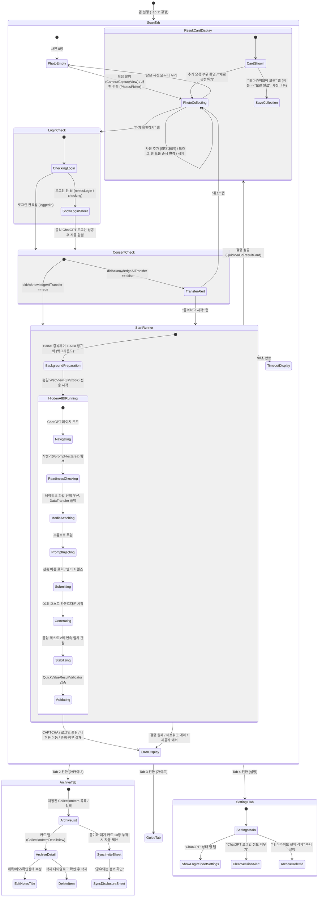

# DenimDex Android 인수인계 기술서 v3.0

> **문서 상태**: 2026-08-29의 iOS 소스와 단위 테스트를 감사해 작성한 Android 이식 기준
> **대상 플랫폼**: Android Phone / Tablet / Foldable / Google TV
> **원본 소스 기준**: `/Users/armsone/git/DenimDex-iOS` (Swift 5.0, SwiftUI, SwiftData, WebKit AIBI, Vision/HanAI)
> **기준 일자**: 2026-08-29
> **버전/빌드**: Version `0.1.0` (Build `202608290731`)
> **이전 기술서 관계**: `docs/DenimDex-기술서-v2.0-AIBI.md`보다 현재 구현을 우선한다. 단, 이 문서에서 **제안** 또는 **미검증**으로 표시한 Android 적응은 iOS에 구현된 사실이 아니다.

---

## 1. 제품 정의 및 핵심 아키텍처 원칙

### 1.1 제품 목적 및 가치 제안
**DenimDex**는 사용자가 빈티지 데님의 실루엣과 세부 디테일 사진을 촬영/선택하면, 별도의 유료 API Key나 자체 서버 없이 사용자의 로그인된 공식 AI 웹 세션(AIBI)을 활용하여 **제품 정체(브랜드·모델·연대), 컨디션, 한국(KRW) 및 일본(JPY) 시장 예상 판매가/순수익, 교차 시장 차익(Arbitrage Margin)**을 빠르고 결정론적으로 산출하여 로컬 개인 아카이브에 축적하는 가치 판단 및 도감 앱이다.

> **한 줄 정의**:
> "사진을 찍으면 한·일 시장 가치와 순수익을 즉시 확인하고, 개인 도감에 안전하게 기록하는 온디바이스 빈티지 데님 아카이브."

### 1.2 핵심 설계 원칙 (Zero-Server Architecture)
1. **무(無) 백엔드·무(無) 개발자 API Key**: 상시 애플리케이션 서버, 사용자 계정 서버, 원격 사진 저장소를 일절 운영하지 않는다. 개발자의 OpenAI API Key를 앱 바이너리에 탑재하지 않는다.
2. **AIBI(AI Browser Interface) 웹 세션 재사용**: 사용자가 공식 웹사이트(현재 ChatGPT)에 직접 로그인한 브라우저 세션을 재활용한다.
3. **비밀번호·토큰 비접근**: 사용자의 로그인 비밀번호, 세션 토큰, 원시 쿠키를 앱 코드로 절대 추출·보관·전송하지 않는다.
4. **결정론적 가치 산술 (Host-Calculated Valuation)**: AI는 예상 판매가 범위와 환율 추정치만 제시하며, 판매 수수료(10%), 국내 배송비(한국 5,000원, 일본 1,000엔), 국제 배송비(30,000원), 순수익 및 교차 시장 마진은 앱(호스트)이 결정론적 수식으로 직접 계산한다.
5. **엄격한 스키마 검증 및 비관찰 사진 참조 거부**: AI의 응답은 JSON 코드 블록으로 강제되며, 검증기(`QuickValueResultValidator`)를 통과하지 못하면 화면에 반영되지 않는다. 특히 AI가 이번 요청에 전송하지 않은 사진 식별자를 관찰 근거로 제시할 경우 즉시 거부한다.
6. **호스트 소유 90초 타임아웃**: AIBI 내부 타이머와 별개로, 프롬프트 전송 확인 시점부터 90초(`1:30 → 0:00`) 카운트다운을 화면에 표시하고, 초과 시 안전하게 취소 및 복구 경로를 제공한다.
7. **개인정보 최소화 및 로컬 영속성**: 전송용 사진은 재인코딩하면서 원본 EXIF/위치 메타데이터를 복사하지 않고 임시 생성하며, 분석 완료/취소 시 앱 임시본을 폐기한다. 사용자가 보관한 원본 사진과 분석 결과는 기기 로컬 데이터베이스(iOS: SwiftData, Android: Room)에 저장된다. AI 제공자 측 보관은 별도 정책이다.

---

## 2. 전체 화면 흐름 및 상태 머신 (Complete User Flow & State Transitions)



### 2.1 상태·취소·재시작의 정확한 계약

| 상태/행동 | 화면과 데이터 결과 |
|---|---|
| `.idle` | 사진 수집 UI. 사진은 `ScanView` 메모리에만 있고 앱 재실행 시 복구되지 않는다 |
| `.running` 전처리 중 | 한양 선별·JPEG 정규화가 백그라운드에서 돈다. 아직 90초 카운트다운을 시작하지 않는다 |
| `.running` + `GENERATING/STABILIZING` | 전송 확인 시각부터 90초 카운트다운. 사진·순서 변경과 재실행 버튼은 잠김 |
| 사용자가 `취소` | 전처리 task, 호스트 timeout, AIBI timer를 취소하고 임시 첨부 파일·숨김 WebView를 폐기한다. 상태는 `.cancelled`; 담은 원본 사진은 유지되며 별도 취소 패널은 렌더링하지 않는다 |
| `.failed(message)` | 메시지와 `다시 시도` 표시. 버튼은 **즉시 재전송하지 않고** `runner.reset()`만 호출해 수집 상태로 돌아간다. 사진은 유지되므로 사용자가 `가치 확인하기`를 다시 눌러야 한다 |
| `.timedOut` | AIBI 작업을 취소하고 고정 타임아웃 문구/`다시 시도`를 표시한다. 재시작 방식은 실패와 동일하다 |
| `.succeeded` | 결과 카드 표시. AI 원문은 앱 UI에 그대로 노출하지 않고 검증된 모델만 표시한다 |
| `추가 사진 지시` / `새로 감정하기` | 둘 다 `runner.reset()`만 실행하므로 기존 사진은 유지되고 결과 카드가 사라진다 |
| `내 아카이브에 보관` | 현재 **원본 1~30장 전체**와 검증 결과/원 JSON을 SwiftData에 저장한 뒤 runner와 감정 사진을 모두 비운다 |
| `전체 지우기` | 확인창 뒤 현재 감정 사진과 runner만 비운다. 사진 앱 및 이미 저장된 아카이브는 건드리지 않는다 |
| 로그인 시트 닫기 | 로그인 확인 전이면 예약된 분석을 취소하고 사진을 유지한다. 로그인 성공 시 시트가 닫힌 뒤 전송 동의 단계부터 자동 재개한다 |
| 탭 전환 | 현재 SwiftUI 인스턴스가 유지되는 동안 감정 상태를 보존한다. 영구 보존 계약은 아카이브 항목뿐이다 |

`AIBIPhase` 전체 열거는 `IDLE → INITIALIZING → NAVIGATING → READY_CHECKING → ATTACHING_MEDIA → INJECTING_PROMPT → SUBMITTING → GENERATING → STABILIZING → COMPLETED`이며, 어느 단계에서든 `FAILED` 또는 `CANCELLED`로 끝날 수 있다. `FALLBACK_REQUIRED`와 보이는 브라우저 승격은 공용 AIBI 기능이지만 Quick Value의 `.hiddenOnly` 작업에서는 사용하지 않는다.

---

## 3. 화면별 세부 명세, 팝업, 다이얼로그 및 예외 복구

### 3.1 탭 네비게이션 구조 (`ContentView.swift`)
*   **앱 고정 테마**: Light 모드 강제 (`.preferredColorScheme(.light)`). 흰색 카드 위에 다크 모드 동적 텍스트가 흰색으로 렌더링되는 시각적 결함을 방지함.
*   **탭 바 틴트**: `DenimTheme.indigo` (`#0B2940` / `rgba(11, 41, 64, 1.0)`).
*   **탭 바 배경**: `.ultraThinMaterial`, 항상 표시 (`.toolbarBackground(.visible, for: .tabBar)`).
*   **4대 탭 구성**:
    1. `ScanView` (감정): `Label("감정", systemImage: "camera.viewfinder")`
    2. `MyDenimListView` (아카이브): `Label("아카이브", systemImage: "square.stack.3d.up.fill")`
    3. `LearnView` (가이드): `Label("가이드", systemImage: "book.closed.fill")`
    4. `SettingsView` (설정): `Label("설정", systemImage: "gearshape.fill")`

---

### 3.2 [탭 1] 감정 화면 (`ScanView.swift`, `QuickValueResultCard.swift`, `CameraCaptureView.swift`)

#### 화면 레이아웃 및 뷰 계층
1. **스크롤 컨테이너**: `ScrollView` + `safeAreaPadding(.vertical, 16)` + `denimDynamicIslandFade()` (상태바/다이내믹 아일랜드 아래로 스크롤 시 58pt 부드러운 페이드아웃).
2. **헤더 카드 (Archive Header)**:
   - 배경: `DenimTheme.indigoGradient` (Deep Indigo -> Indigo -> Slate Blue).
   - 라벨: `DenimEyebrow("DenimDex · Private Archive")` (색상: `washedDenim`) + `Text("EST. 2026")` (White 50%).
   - 타이틀: `Text("당신의 데님,\n가치를 발견하다")` (Font 34pt semibold, White, tracking -1.1).
   - 서브타이틀: `Text("제품의 정체와 한·일 시장 가치를 한 번에 살펴보세요.")` (White 68%).
   - 우하단 장식선: Brass 75%, 가로 54pt, 세로 2pt.
3. **감정 사진 수집기 (`photoCollector`)**:
   - 카드 컨테이너: `denimCard(padding: 0)`.
   - 상단 헤더: `Text("감정 사진")` (Title3 Bold) + `Text("실루엣부터 라벨과 작은 각인까지")` (Caption Secondary).
   - 장수 뱃지: `Text("\(photos.count) / 30")` (Caption Bold, Monospaced, Capsule 배경 `fadedDenim`, 글자 `indigo`).
   - 전체 삭제 버튼: 사진이 있을 때만 표시. `Image(systemName: "trash")` 원형 버튼.
   - 안내 문구: `Text("사진을 길게 눌러 중요도 순으로 정리할 수 있어요.")` (Caption Secondary).
   - 사진 그리드: 3열 `LazyVGrid(columns: 3, spacing: 10)`.
     - 각 썸네일: 1:1 Aspect Ratio, CornerRadius 12pt continuous. 우상단 `xmark.circle.fill` 삭제 버튼, 좌하단 `line.3.horizontal` 드래그 핸들 아이콘.
     - 드래그 앤 드롭 순서 변경: `PhotoReorderDropDelegate` 지원.
     - 추가 타일: `photos.count < 30`일 때 표시. `offWhite` 배경 + `Image(systemName: "plus")` + `Text("사진 추가")`.
   - 하단 버튼 바:
     - `Button("직접 촬영", systemImage: "camera.fill")` -> `CameraCaptureView` 전체화면 오픈.
     - `PhotosPicker("사진 선택", systemImage: "photo.on.rectangle")` -> 순서 보존(`selectionBehavior: .ordered`), 최대 `30 - count`장 선택.
4. **실행 버튼**:
   - `Button("가치 확인하기", systemImage: "sparkles")` -> `.buttonStyle(.denimPrimary)`.
   - 활성화 조건: `!photos.isEmpty && !isLoadingPhotos && runner.state != .running`.
   - 비활성 시 하단 안내: `Text("사진 한 장부터 시작할 수 있어요. 원본은 30장까지 담고, 가장 선명한 사진을 골라 분석합니다.")`.
5. **진행 중 패널 (`runningPanel`)**:
   - 숨김 모드 실행 중(`!isVisibleBrowserPresented`) ScanView 내 카드에 표시.
   - `AIBIProgressRow`: 상태 아이콘 (스피너 / 체크 / 경고) + `session.progress.statusMessage` + `Button("취소")`.
   - 카운트다운 행: `Text("남은 시간 1:30")` (Font Caption Semibold) + `ProgressView(value: fraction)` (Indigo 틴트).
   - 사진 요약: `Text("\(sentPhotoCount)장 분석 · 유사 사진 N장 제외 · 전송 한도 M장 제외")`.
6. **가치 결과 카드 (`QuickValueResultCard.swift`)**:
   - 분석 성공 시 표시되는 정밀 결과 리포트 (상세 명세는 3.2.2절 참조).
7. **에러 / 타임아웃 패널**:
   - 에러 시: `Label(message, systemImage: "exclamationmark.triangle.fill")` (Signal Red) + `Button("다시 시도")`.
   - 타임아웃(90초 만료) 시: `Label("분석이 예상보다 오래 걸리고 있어요. 잠시 후 다시 시도해주세요.", ...)` + `Button("다시 시도")`.

---

#### 3.2.2 가치 결과 카드 상세 명세 (`QuickValueResultCard.swift`)
*   **상단 메타**:
    - `DenimEyebrow("Valuation Report")`
    - 신뢰도 뱃지: `Label(confidence.displayName, systemImage: confidence.iconName)`
      - `high`: `"신뢰도 높음"`, `checkmark.seal.fill`, `DenimTheme.successGreen`
      - `medium`: `"신뢰도 보통"`, `questionmark.circle.fill`, `DenimTheme.brass`
      - `low`: `"신뢰도 낮음"`, `exclamationmark.triangle.fill`, `DenimTheme.signalRed`
      - `unknown`: `"판단 보류"`, `questionmark.diamond.fill`, `DenimTheme.signalRed`
*   **제품 추정 헤더**:
    - 브랜드 + 모델: `Text("Levi's 501")` (Title2 Bold, Charcoal)
    - 연대: `Text("1990s 판단 어려움")` (Caption Semibold, Indigo Bright)
    - 요약문: `Text(result.summary)` (Subheadline, Ink Soft)
*   **한·일 이원 시장 카드 행 (`marketCardsRow`)**:
    - 좌측 (한국): 틴트 `indigo`, `Text("한국")`, 판매가 추정 `Text("KRW 80,000 ~ 180,000")`, 구분선, 순수익 추정 `Text("KRW 67,000 ~ 157,000")` (`successGreen`).
    - 우측 (일본): 틴트 `coolBlue`, `Text("일본")`, 판매가 추정 `Text("JPY 8,000 ~ 18,000")`, 구분선, 순수익 추정 `Text("JPY 6,200 ~ 15,200")` (`successGreen`).
*   **컨디션 행**:
    - `Text("컨디션")` (Caption Secondary) vs `Text(condition.displayName)` (Caption Bold Charcoal).
    - 값: 최상(`excellent`), 양호(`good`), 보통(`fair`), 사용감 많음(`poor`), 확인되지 않음(`unknown`).
*   **가치를 만든 디테일 (`valueReasons`)**:
    - `Label(reason, systemImage: "checkmark")` (Caption).
*   **시장별 판매 기회 (Cross-Market Arbitrage Section)**:
    - 배경: `fadedDenim` (opacity 0.72), CornerRadius 16pt.
    - 제목: `DenimSectionTitle(title: "시장별 판매 기회")`.
    - 1행: `Text("일본 구매 → 한국 판매")` vs `Text("KRW -84,000 ~ 78,000")` (low >= 0 ? successGreen : signalRed).
    - 2행: `Text("한국 구매 → 일본 판매")` vs `Text("KRW -165,200 ~ -400")` (low >= 0 ? successGreen : signalRed).
    - 추천 문구:
      - `japanToKorea`: `"일본에서 매입해 한국에서 판매하는 편이 유리합니다."` (`successGreen`)
      - `koreaToJapan`: `"한국에서 매입해 일본에서 판매하는 편이 유리합니다."` (`successGreen`)
      - `noClearAdvantage`: `"현재 추정으로는 뚜렷하게 유리한 시장이 없습니다."` (`secondary`)
    - 마진 산정 각주: `Text("국제 배송비 30,000원과 판매 수수료 10%를 반영한 추정입니다. 관세·세금·환전 수수료·반품·환율 변동은 포함되지 않습니다.")`.
*   **면책 조항 섹션 (`disclaimerSection`)**:
    - 배경: `signalRed` (opacity 0.045), CornerRadius 14pt.
    - `Label("현재 가격은 실시간 거래 자료가 아닌 AI 기반 추정치입니다.", systemImage: "exclamationmark.triangle")` (Signal Red).
    - `Text("한국: 판매 수수료 10%와 국내 배송비 5,000원 반영")`
    - `Text("일본: 판매 수수료 10%와 국내 배송비 1,000엔 반영")`
    - `Text("적용 환율: 1엔 ≈ 9.10원")`
*   **AI 주의사항 리스트 (`caveats`)**: `Text("· " + caveat)` (Caption2 Secondary).
*   **하단 액션 버튼들**:
    - `Button("내 아카이브에 보관", systemImage: "square.and.arrow.down")`: 내부적으로 `didSave=true`와 `"보관 완료"` 상태가 있으나, 현재 부모 `saveToCollection`이 즉시 runner와 사진을 초기화하므로 정상 화면에서는 결과 카드 자체가 곧 사라지고 빈 감정 화면으로 돌아간다.
    - `Button(result.nextPhotoInstruction, systemImage: "camera.badge.ellipsis")` -> 추가 사진 안내가 있을 때 표시, ScanView 입력으로 복귀.
    - `Button("새로 감정하기")` -> `.denimSecondary`, 상태 초기화.
    - 각주: `Text("거래 근거를 더하는 정밀 조사는 준비 중입니다.")` (Caption2 Secondary).

---

#### 3.2.3 연속 촬영 카메라 화면 (`CameraCaptureView.swift`)
*   **기능**: 단발 촬영 후 닫히지 않고, 셔터를 누를 때마다 갤러리에 백그라운드 저장하며 연속으로 최대 30장까지 촬영.
*   **상단 UI**:
    - 좌측: `Button("취소")` (반투명 블랙 캡슐 배경, 취소 시 임시 촬영분 모두 폐기 후 닫힘).
    - 중앙: `UILabel("  N/30  ")` (현재 장수 실시간 표시).
    - 우측: `Button("완료")` (촬영된 사진 배열을 부모 뷰로 전달하고 닫힘).
*   **하단 UI**:
    - 중앙: 셔터 버튼 (지름 72pt 원형 흰색 버튼 + 6pt 반투명 흰색 테두리).
    - 좌측: 카메라 전/후면 전환 버튼 (`camera.rotate.fill`).
    - 우측: 플래시 토글 버튼 (`bolt.slash.fill` / `bolt.fill`).
*   **사진 앱 저장 처리**: 촬영 즉시 `PHPhotoLibrary.shared().performChanges`로 저장 시도. 권한 미부여 시 `onPhotoLibrarySaveIssue` 콜백 발화 -> 부모 뷰에서 알림 표시.

---

### 3.3 [탭 2] 아카이브 화면 (`MyDenimListView.swift`, `CollectionItemDetailView.swift`)

#### 3.3.1 목록 및 검색 (`MyDenimListView.swift`)
*   **네비게이션 타이틀**: `"내 아카이브"` (Large Title).
*   **검색창**: `.searchable(text: $searchText, prompt: "브랜드, 모델 또는 메모")` (브랜드, 모델, 메모, 표시 제목 실시간 필터링).
*   **빈 상태 (Empty State)**:
    - 112x112pt `indigoGradient` 둥근 사각형 + `Image(systemName: "square.stack.3d.up")` (38pt).
    - `DenimEyebrow("Private Collection")`
    - `Text("첫 데님을 보관해보세요")` (Title3 Semibold)
    - `Text("사진으로 가치를 확인하고\n당신만의 아카이브를 완성해보세요.")` (Subheadline Secondary).
*   **아이템 행 (`CollectionItemRow`)**:
    - 좌측: 76x76pt 대표 썸네일 (CornerRadius 14pt).
    - 우측 정보:
      - 표시 제목: `userTitle` 우선, 비어있을 시 `brandGuess + " " + modelGuess`, 둘 다 없으면 `"이름 없는 데님"`.
      - 가격 범위: `item.formattedValueRange` (예: `"KRW 80,000 ~ 180,000"`, Indigo Bold).
      - 확인 상태: `item.verificationState.displayName` (`"AI 추정"`, `"사용자 확인"`, `"출처 확인됨"`).
    - 스와이프 삭제: `onDelete` 지원.
*   **10장 누적 동기화 자동 제안**:
    - 조건: `pendingSyncCount >= 10 && pendingSyncCount - lastSyncPromptCount >= 10`.
    - 아카이브 탭으로 돌아오는 시점(`onAppear`)에 `SyncInviteView` 시트 자동 호출.

#### 3.3.2 아카이브 상세 (`CollectionItemDetailView.swift`)
*   **사진 캐러셀**: 244x270pt 크기의 사진 가로 스크롤 (`ScrollView(.horizontal)`).
*   **사용자 제목 수정**: `TextField("이름을 지어주세요", text: $item.userTitle)` (Title2 Semibold).
*   **가격 및 가치 기준 카드**:
    - `Text(item.formattedValueRange)` (Title2 Bold Charcoal).
    - `Label(item.valueBasis.badgeText, systemImage: "sparkles")` (`"AI 가치 추정"` 등).
*   **속성 정보 그리드**: 브랜드, 모델, 추정 연대, 컨디션, 판단 신뢰도, 기록일 (`LabeledContent`).
*   **감정 요약문**: `Text(item.summary)`.
*   **확인 상태 세그먼트**: `Picker("확인 상태", selection: $item.verificationStateRaw)` (`"AI 추정"` vs `"사용자 확인"`). 변경 시 `markEligibleForSyncIfNeeded()` 호출.
*   **메모 작성기**: `TextEditor(text: $item.userNotes)` (최소 높이 90pt, 변경 즉시 로컬 저장).
*   **삭제 버튼**: `Button("아카이브에서 삭제", systemImage: "trash")` -> 삭제 확인 다이얼로그 후 삭제 및 뷰 닫기.

---

### 3.4 [탭 3] 가이드 화면 (`LearnView.swift`)
*   **네비게이션 타이틀**: `"감정 가이드"` (Large Title).
*   **상단 배너**: `indigoGradient` 배경 + `DenimEyebrow("Field Guide")` + `"디테일을 기록하는\n가장 좋은 방법"` + `"더 정교한 감정을 위한 데님 촬영 가이드"`.
*   **가이드 섹션 구성**:
    1. **사진은 몇 장이 좋을까요?** (`camera.fill`): 1장부터 가능, 최대 30장 수집 후 선명한 사진 선별 분석 안내.
    2. **가치를 잘 보여주는 촬영법** (`checkmark.circle.fill`):
       - 전체 실루엣: 밝은 곳 정면 전신 샷.
       - 레드탭과 패치: 초점 맞춘 근접 샷.
       - 버튼과 리벳: 그림자 없는 각인 샷.
       - 케어 라벨: 주름 펴고 글자 또렷하게 촬영.
    3. **확인하면 좋은 디테일** (`tag.fill`): `EvidencePhotoRole.allCases` 13개 부위 명칭 나열 (전체 앞면, 전체 뒷면, 레드탭, 상단 버튼 앞면, 상단 버튼 뒷면 각인, 케어라벨, 가죽·종이 패치, 리벳, 지퍼·버튼 플라이, 셀비지, 봉제·아큐에이트, 오염·수선·마모, 크기 비교 기준).
    4. **컨디션 기준** (`gauge.with.dots.needle.50percent`): 최상, 양호, 보통, 사용감 많음.
    5. **판단 신뢰도** (`gauge.medium`): 일치 특징 수에 따른 신뢰도 산정 및 미단정 원칙 안내.
    6. **두 가지 가치 기준** (`wonsign.circle.fill`): 빠른 AI 추정 vs 근거 조사(준비 중).
    7. **이용 전 확인해주세요** (`info.circle.fill`): 정품 인증서/공식 감정서가 아님을 명시하는 법적 고지.

---

### 3.5 [탭 4] 설정 화면 (`SettingsView.swift`)
*   **네비게이션 타이틀**: `"설정"` (Large Title).
*   **섹션 1: 헤더**: `"Privacy & Collection"`, `"당신의 기록을\n안전하게 관리합니다"`.
*   **섹션 2: ChatGPT 연결**:
    - 상태 행: `Button` (좌측: `Text("ChatGPT")`, 우측: 상태 뱃지 `Label(status.title, systemImage: status.iconName)`).
      - `확인 중` (Secondary), `로그인됨` (SuccessGreen), `로그인 필요` (WarningAmber).
      - 탭 시 공식 로그인 시트(`AIBILoginSheet`) 열림.
    - 세션 삭제: `Button("ChatGPT 로그인 정보 지우기")` (`signalRed`) -> `WKWebsiteDataStore`의 `chatgpt.com`, `chat.openai.com` 데이터 레코드 삭제 -> 알림창 `"ChatGPT 로그인 정보를 지웠어요"`.
    - 안내 문구: `"로그인은 ChatGPT 공식 화면에서만 진행됩니다. DenimDex는 비밀번호와 로그인 쿠키를 읽거나 별도로 저장하지 않습니다."`
*   **섹션 3: 아카이브 동기화**:
    - `LabeledContent("연결 상태", value: "연결되지 않음")` + `"현재는 이 기기의 개인 아카이브만 사용합니다. 개인 NAS 연결은 준비 중입니다."`
*   **섹션 4: 사진과 개인정보**:
    - `"원본 사진은 기본적으로 이 기기에만 보관됩니다. 감정을 시작하면 사진 사본과 분석 요청이 로그인된 ChatGPT로 전송되며, 전송용 사본은 작업 후 폐기됩니다."`
*   **섹션 5: 아카이브 관리**:
    - `Button("내 아카이브 전체 삭제", systemImage: "trash")` (Destructive) -> SwiftData 모든 아이템 일괄 삭제.
    - 안내: `"보관 중인 데님 기록 N개가 모두 삭제되며 되돌릴 수 없습니다."`
*   **섹션 6: 버전 정보**:
    - `LabeledContent("버전", value: "0.1.0")`.

---

### 3.6 팝업, 알림창 및 시트 문자열 대조표 (Exact Korean Strings)

| 화면 / 시점 | UI 형태 | 제목 / 타이틀 | 본문 / 메시지 | 버튼 구성 (순서 및 역할) |
|---|---|---|---|---|
| **AI 전송 사전 동의** (`ScanView`) | Alert | `사진 분석을 시작할까요?` | `선택한 사진의 사본과 분석 요청이 로그인된 ChatGPT로 전송됩니다. DenimDex 서버에는 남지 않으며, 전송용 사본은 분석 후 폐기됩니다.` | 1. `취소` (Cancel)<br>2. `동의하고 시작` (Default) |
| **사진 앱 저장 실패** (`ScanView`) | Alert | `사진 앱에 저장하지 못했어요` | `촬영한 사진은 감정 목록에 담겼지만 사진 앱에는 저장되지 않았어요. 설정에서 사진 추가 권한을 확인해주세요.` | 1. `확인` (Cancel) |
| **사진 전체 비우기** (`ScanView`) | Confirmation Dialog | `담은 사진을 모두 비울까요?` | `현재 감정을 위해 담은 사진만 비워집니다. 사진 앱과 아카이브의 원본은 그대로 유지됩니다.` | 1. `모두 비우기` (Destructive)<br>2. `취소` (Cancel) |
| **공식 ChatGPT 로그인** (`AIBILoginSheet`) | Sheet | `ChatGPT 로그인` | `ChatGPT에 로그인해주세요. 로그인이 확인되면 이 창이 자동으로 닫히고 가치 분석을 계속합니다.`<br>*(완료 시: `로그인을 확인했어요`)* | 1. `닫기` (CancellationAction) |
| **보이는 브라우저 공용 컴포넌트** (`AIBIVisibleBrowserSheet`) | Sheet *(현재 Quick Value에서 도달하지 않음)* | `ChatGPT` | 상단 진행률 및 카운트다운 행 + 브라우저 화면 | 1. `취소`<br>2. `···` 메뉴 (`문구 복사`, `결과 붙여넣기`) |
| **수동 결과 붙여넣기 공용 컴포넌트** | Sub-Sheet *(현재 Quick Value에서 도달하지 않음)* | `결과 붙여넣기` | `ChatGPT 화면에서 답변을 복사해 아래에 붙여넣으세요.` | 1. `이 내용으로 가져오기`<br>2. `닫기` |
| **아카이브 항목 삭제** (`CollectionItemDetailView`) | Confirmation Dialog | `아카이브에서 삭제할까요?` | *(메시지 없음)* | 1. `아카이브에서 삭제` (Destructive)<br>2. `취소` (Cancel) |
| **로그인 정보 삭제 완료** (`SettingsView`) | Alert | `ChatGPT 로그인 정보를 지웠어요` | *(메시지 없음)* | 1. `확인` (Cancel) |
| **도감 확장 제안** (`SyncInviteView`) | Sheet | `아카이브를 확장할까요?` | `다른 컬렉터의 기록으로 내 아카이브를 넓히고,\n내 기록도 익명으로 함께 나눕니다.` | 1. `지금 확장하기` (Primary)<br>2. `나중에` (Secondary)<br>3. `공유되는 정보 확인` (Text Button) |
| **공유 정보 확인** (`SyncDisclosureView`) | Sub-Sheet | `공유 정보` | **함께 나누는 정보**: `브랜드, 모델, 추정 연대, 확인된 특징, 컨디션, 가격 범위, 통화, 국가, 기록일과 익명 식별 정보`<br>**공유하지 않는 정보**: `원본 사진, 이름, 이메일, 위치, ChatGPT 로그인 정보와 대화 원문` | 1. `닫기` (CancellationAction)<br>2. 각 아이템별 체크박스 토글 |

### 3.7 오류 문자열과 복구 동작

| 발생 지점 | 사용자에게 표시될 문자열 | 다음 행동 |
|---|---|---|
| ChatGPT config 없음 | `ChatGPT 설정을 불러오지 못했습니다.` | `다시 시도`는 reset만 수행 |
| 사진 장수 guard | `사진은 1장부터 30장까지 선택해주세요.` | 사진 수정 후 다시 가치 확인 |
| 이미지 정규화 실패 | `사진을 전송용으로 준비하지 못했습니다. 사진을 확인하고 다시 시도해주세요.` | reset 후 사진 교체 가능 |
| 공급자 media capability 불일치 | `이 작업에서는 사진 첨부를 지원하지 않습니다.` | config 수정 없이는 재시도해도 동일 |
| provider URL 불량 | `잘못된 제공자 주소입니다.` | config 수정 필요 |
| readiness 35초 만료 | `ChatGPT 입력 화면을 준비하지 못했습니다. 잠시 후 다시 시도해주세요.` | 로그인 상태/네트워크 확인 후 재시도 |
| 원자 첨부 실패 | `사진을 ChatGPT에 모두 첨부하지 못했습니다. 다시 시도해주세요.` | 부분 결과 사용 금지, 전부 다시 전송 |
| prompt 입력 실패 | `ChatGPT 입력 화면을 제어하지 못했습니다. 다시 시도해주세요.` | DOM selector 회귀 확인 |
| 로그인 풀림 | `ChatGPT 로그인이 필요합니다. 설정의 AI 로그인 관리에서 먼저 로그인해주세요.` | 설정 또는 분석 전 로그인 시트에서 로그인 |
| 보안 challenge | `ChatGPT 보안 확인이 필요합니다. 설정의 AI 로그인 관리에서 확인해주세요.` | 로그인 시트에서 사용자 처리 |
| 비허용 이동 | `ChatGPT가 허용되지 않은 페이지로 이동했습니다. 설정에서 로그인 상태를 확인해주세요.` | origin config와 로그인 경로 확인 |
| 네트워크 탐색 실패 | `네트워크 오류: {localizedDescription}` | reset 후 재시도; 무한 자동 재시도 없음 |
| sink/JSON 검증 실패 | 현재 runner 화면에는 `가치 확인을 완료하지 못했어요. 잠시 후 다시 시도해주세요.` | 사진 유지, reset 후 다시 가치 확인. 공용 AIBI 상태에는 검증 상세가 있으나 UI에 노출하지 않음 |
| 생성 90초 만료 | `분석이 예상보다 오래 걸리고 있어요. 잠시 후 다시 시도해주세요.` | AIBI 취소·정리 후 reset |
| 사진 앱 저장 실패 | 3.6절 alert의 제목/본문 | 감정 사진은 유지; OS 사진 추가 권한 확인 |
| NAS 실행 | `아직 NAS 주소가 설정되지 않아 동기화를 진행할 수 없습니다.` | 성공 상태로 바꾸지 않음 |

설정의 `내 아카이브 전체 삭제`는 현재 확인 팝업 없이 즉시 실행되고 되돌릴 수 없다. Android 동등 구현도 현 동작을 문서상 기준으로 삼되, 출시 전에 확인창 추가 여부를 제품 안전성 항목으로 재검토한다.

---

## 4. 소스 코드 참조 및 핵심 데이터 모델 / JSON 계약

### 4.1 소스 파일 및 역할 매핑 테이블

| 구분 | 파일 경로 | 주요 타입 / 클래스 | 핵심 함수 / 역할 | 대응 테스트 파일 |
|---|---|---|---|---|
| **앱 진입점** | `DenimDex/DenimDexApp.swift` | `DenimDexApp` | SwiftData `ModelContainer` 초기화, WindowGroup 설정 | - |
| **메인 쉘** | `DenimDex/ContentView.swift` | `ContentView` | 4대 탭 바 구성, Light 모드 강제, 틴트 컬러 지정 | - |
| **디자인 토큰** | `DenimDex/Design/DenimTheme.swift` | `DenimTheme`, `DenimCardModifier` | 색상, 그라디언트, 카드/버튼 스타일, 다이내믹 아일랜드 페이드 | - |
| **데이터 모델** | `DenimDex/Models/QuickValueResult.swift` | `QuickValueResult`, `QuickValueConfidence`, `QuickValueCondition`, `QuickValueBasis` | Quick Value V2 JSON 매핑 모델, 신뢰도/컨디션 열거형 | `QuickValueResultValidatorTests.swift` |
| **데이터 모델** | `DenimDex/Models/CollectionItem.swift` | `CollectionItem`, `VerificationState`, `SyncEligibilityState` | SwiftData 영속성 엔티티, 한·일 가격 및 JSON 보관 | - |
| **데이터 모델** | `DenimDex/Models/QuickValuePhotoRoles.swift` | `QuickValuePhotoRoles` | `photo_1` ~ `photo_20` 결정론적 식별자 생성 (`minCount=1, maxCount=20`) | `QuickValuePhotoRolesTests.swift` |
| **데이터 모델** | `DenimDex/Models/EvidencePhotoRole.swift` | `EvidencePhotoRole` | 13개 세부 사진 부위 정의 (가이드 및 향후 정밀조사용) | - |
| **서비스** | `DenimDex/Services/QuickValuePromptBuilder.swift` | `QuickValuePromptBuilder` | V2 이원 시장 프롬프트 생성기 (`schemaVersion: 2`) | `QuickValuePromptBuilderTests.swift` |
| **서비스** | `DenimDex/Services/QuickValueResultValidator.swift` | `QuickValueResultValidator`, `QuickValueValidationError` | 2단계 엄격/유연 JSON 디코더, 스키마/범위/비관찰 사진 검증 | `QuickValueResultValidatorTests.swift` |
| **서비스** | `DenimDex/Services/MarketValueCalculator.swift` | `MarketValueCalculator`, `CrossMarketComparison` | 수수료/배송비 차감 순수익 산출, 교차 시장 차익 및 추천 산출 | `MarketValueCalculatorTests.swift` |
| **서비스** | `DenimDex/Services/CountdownFormatter.swift` | `CountdownFormatter` | 90초 타이머, `1:30` 포맷팅, 진행률 계산, 만료 판정 | `CountdownFormatterTests.swift` |
| **서비스** | `DenimDex/Services/QuickValueImagePolicy.swift` | `QuickValueImagePolicy` | 30장 수집 / 20장 전송, 16MB 배치 예산, 장수별 동적 해상도/품질 | `QuickValueImagePolicyTests.swift` |
| **서비스** | `DenimDex/Services/HanAIPhotoDeduplicator.swift` | `HanAIPhotoDeduplicator` | Apple Vision `VNFeaturePrint` + 라플라시안 분산 선명도 기반 중복제거 | - |
| **AIBI 코어** | `DenimDex/AIBI/AIBIModels.swift` | `AIBIPhase`, `AIBITask`, `AIBIResult`, `AIBIProgress`, `AIBIProviderConfig` | AIBI 상태 머신, 설정 스키마, 결합 인터페이스 | - |
| **AIBI 코어** | `DenimDex/AIBI/AIBISession.swift` | `AIBISession` | 숨김/보이는 WKWebView 오케스트레이터, JS 주입, 승격 | - |
| **AIBI 코어** | `DenimDex/AIBI/AIBILoginProbe.swift` | `AIBILoginStatusStore`, `AIBILoginSheet` | 375x667 숨김 DOM 프로브를 통한 ChatGPT 로그인 상태 판정 | - |
| **AIBI 코어** | `DenimDex/AIBI/AIBIMediaPipeline.swift` | `AIBIImageNormalizer`, `AIBIMediaAttachment` | EXIF 제거, 회전 보정, 다단계 JPEG 압축 및 리사이즈 | - |
| **AIBI 코어** | `DenimDex/AIBI/AIBIProviderRegistry.swift` | `AIBIProviderRegistry` | `aibi-providers.json`, `aibi-browser-runtime.js` 번들 로더 | - |
| **스캔 기능** | `DenimDex/Features/Scan/QuickValueRunner.swift` | `QuickValueRunner`, `QuickValueRunState` | 백그라운드 전송 준비, 호스트 90초 타이머 강제, 결과 커밋 | - |
| **동기화 기능**| `DenimDex/Features/Sync/DenimDexSyncClient.swift`| `DenimDexSyncClient`, `DisabledDenimDexSyncClient` | NAS 프로토콜 정의 (현재 미설정 에러 반환) | - |

> Quick Value가 만드는 `AIBITask.presentation`은 `.hiddenOnly`이다. 따라서 `AIBISession.escalateToVisible`은 인증·챌린지·비허용 이동을 보이는 브라우저로 승격하지 않고 오류로 종료한다. 로그인은 분석 시작 전 별도 `AIBILoginSheet`에서 처리한다. `AIBIVisibleBrowserSheet`와 수동 붙여넣기 코드는 공용 엔진에 존재하지만 현재 제품 흐름에서는 비활성이다.

#### `CollectionItem` 영속 모델의 정확한 필드

| 필드 | Swift 타입 | Android Room 타입/의미 |
|---|---|---|
| `id` | `UUID` | TEXT primary key |
| `createdAt`, `updatedAt` | `Date` | epoch millis 2개 |
| `userTitle` | `String` | 사용자 제목 |
| `photosData` | `[Data]` | 순서 보존 BLOB 목록. Room에서는 child table(`itemId`,`position`,`bytes`) 권장 |
| `photoRoleRawValues` | `[String]` | 사진과 같은 순서의 역할 문자열 |
| `brandGuess`, `modelGuess`, `eraGuess`, `summary` | `String` | AI 추정 텍스트 |
| `confidenceRaw`, `conditionRaw` | `String` | 허용 enum raw value |
| `currency` | `String` | 현재 저장 생성자는 항상 `KRW` |
| `valueLow`, `valueHigh` | `Int` | 한국 예상 판매가 |
| `valueBasisRaw` | `String` | 현재 항상 `ai_general_estimate` |
| `valueReasons`, `caveats` | `[String]` | 순서 보존 문자열 목록 |
| `japanValueLow`, `japanValueHigh` | `Int?` | V2 이전 항목 호환 nullable JPY 값 |
| `jpyToKrwRateStored` | `Double?` | V2 이전 항목 호환 nullable 환율 |
| `quickValueJSON` | `String` | 검증을 통과한 정제 JSON 원문 |
| `userNotes` | `String` | 사용자 메모 |
| `verificationStateRaw` | `String` | `ai_estimate`, `user_confirmed`, `source_verified` |
| `syncStateRaw` | `String` | `not_eligible`, `pending`, `excluded`, `uploaded` |

생성 시 `verificationStateRaw=ai_estimate`, `syncStateRaw=not_eligible`지만 저장 직후 `markEligibleForSyncIfNeeded()`가 호출되어 현재 실제 저장 항목은 바로 `pending`이 된다. Android는 이 현재 동작을 우선 복제하고, “사용자 확인 후에만 공유 후보”로 바꾸려면 별도 제품 변경으로 다룬다.

#### 비활성 NAS DTO 계약

`ContributionBundle` JSON은 `schemaVersion=1`, `anonymousContributorKey`, `normalizedBrand`, `normalizedModel`, `normalizedEra`, `observedFeatures:[String]`, `condition`, `currency`, `valueLow`, `valueHigh`, `country`, `observedAt`, `aiProvider`, `promptVersion`, `contentFingerprint`를 가진다. 응답 DTO는 `SyncUploadReceipt { acceptedCount:Int, archiveVersion:String }`, manifest는 `ArchiveManifest { version:String, sizeBytes:Int, sha256:String }`이다. 현재 생성 코드는 `observedFeatures=[]`, `country="KR"`, `aiProvider="chatgpt"`, `promptVersion="quick_value.v1"`, contributor key와 fingerprint 모두 item UUID를 쓴다. 엔드포인트·인증·날짜 인코딩·충돌/페이지네이션 계약은 없으며 `DisabledDenimDexSyncClient`가 항상 `notConfigured`를 던진다.

---

### 4.2 Quick Value V2 JSON 출력 계약 (AI Response Schema)

AIBI 런타임을 통해 ChatGPT로부터 수신해야 하는 정확한 JSON 포맷이다. 프롬프트는 오직 아래 단일 JSON 코드 블록만 출력하도록 요구한다.

```json
{
  "schemaVersion": 2,
  "task": "quick_value",
  "productGuess": {
    "brand": "Levi's",
    "model": "501",
    "era": "1990s 판단 어려움"
  },
  "summary": "Levi's 501 레귤러 스트레이트 데님으로 추정되며 자연스러운 페이딩이 있는 상태입니다.",
  "confidence": "medium",
  "condition": "fair",
  "koreaSaleRange": {
    "low": 80000,
    "high": 180000
  },
  "japanSaleRange": {
    "low": 8000,
    "high": 18000
  },
  "jpyToKrwRate": 9.1,
  "observations": [
    {
      "feature": "fly_type",
      "value": "button_fly",
      "evidencePhotoRole": "photo_1",
      "certainty": "observed"
    }
  ],
  "valueReasons": [
    "90년대 미국 생산 501 특유의 버튼 플라이 구조",
    "무릎 및 밑단 사용감 반영"
  ],
  "nextPhotoInstruction": "더 정확한 연대 특정을 위해 상단 버튼 뒷면 각인을 촬영해주세요.",
  "caveats": [
    "실시간 거래 데이터베이스가 연결되지 않은 빠른 AI 추정치입니다.",
    "정품 감정서나 실제 매입가가 아닙니다."
  ]
}
```

#### 허용 열거형 값 (Allowed Enum Values)
*   `confidence`: `"high"`, `"medium"`, `"low"`, `"unknown"`
*   `condition`: `"excellent"`, `"good"`, `"fair"`, `"poor"`, `"unknown"`
*   `observations.certainty`: `"observed"`, `"reported"`, `"inferred"`
*   `task`: 반드시 `"quick_value"`
*   `schemaVersion`: 반드시 `2`

---

### 4.3 프롬프트 생성 템플릿 전문 (`QuickValuePromptBuilder.swift`)

````text
너는 빈티지 데님 감정을 돕는 조사 보조원이다. 첨부된 사진 {photoRoles.count}장을 보고 아래 JSON 스키마 하나만 출력해라. 설명 문장, 인사말, 마크다운 제목을 붙이지 말고 JSON 코드 블록 하나만 응답해라.

사진 순서와 식별자 (관찰 근거를 적을 때 이 식별자를 evidencePhotoRole에 그대로 사용해라):
1번 사진: photo_1
2번 사진: photo_2
...

규칙:
- 이것은 빠른 참고용 추정이며 정품 감정이나 실제 매입가가 아니다. 이 사실을 caveats에 반드시 포함해라.
- 한국(KRW)과 일본(JPY) 두 시장의 예상 판매가 범위를 각각 넓게 추정해라. 실시간 거래 데이터베이스는 연결되어 있지 않으므로, 이는 일반 지식에 기반한 넓은 참고 범위이며 가격과 환율 모두 실시간으로 검증되지 않았다는 사실을 caveats에 명시해라.
- jpyToKrwRate는 "엔화 1엔당 원화" 환율로, 반드시 0보다 큰 값을 제시해라 (예: 9.1).
- 사진에서 직접 보이지 않는 특징을 관찰된 사실처럼 적지 마라.
- 판단이 어려우면 무리하게 브랜드나 모델을 단정하지 말고 confidence를 낮춰라.
- 판단에 도움이 될 사진이 한 장 더 있으면 좋겠다면 nextPhotoInstruction에 한 문장으로 안내해라. 필요 없으면 생략해라.

정확히 이 스키마를 따르는 JSON 코드 블록만 출력해라:
```json
{
  "schemaVersion": 2,
  "task": "quick_value",
  "productGuess": { "brand": "string", "model": "string", "era": "string" },
  "summary": "string, 두 문장 이내",
  "confidence": "high | medium | low | unknown",
  "condition": "excellent | good | fair | poor | unknown",
  "koreaSaleRange": { "low": 0, "high": 0 },
  "japanSaleRange": { "low": 0, "high": 0 },
  "jpyToKrwRate": 9.1,
  "observations": [
    { "feature": "string", "value": "string", "evidencePhotoRole": "photo_1", "certainty": "observed | reported | inferred" }
  ],
  "valueReasons": ["string"],
  "nextPhotoInstruction": "string",
  "caveats": ["string"]
}
```
````

---

### 4.4 결과 검증기 알고리즘 (`QuickValueResultValidator.swift`)

검증기는 다음 순서로 엄격하게 검증하며, 단 하나라도 위반 시 에러를 반환하고 결과를 거부한다.

1. **빈 문자열 체크**: `trimmed.isEmpty` -> `.failure(.emptyResult)`
2. **JSON 코드 블록 추출 (`extractJSONBlock`)**:
   - ```` ```(?:json)?\s*([\s\S]*?)``` ```` 정규식 매칭 우선 추출.
   - 없을 경우 첫 번째 `{`부터 마지막 `}`까지 슬라이싱.
3. **2단계 디코딩 전략**:
   - 1차: `JSONDecoder().decode(QuickValueResult.self, from: data)`
   - 2차 (Fallback): AI가 `"80,000원"`, `"9.1"`처럼 문자열로 수치를 응답하거나 선택 배열을 생략한 경우, `JSONSerialization` 파싱 후 숫자 필터링(`filter { $0.isNumber || $0 == "-" || $0 == "." }`)을 통해 보수적으로 정규화.
4. **스키마 및 태스크 검증**:
   - `schemaVersion == 2` 아니면 -> `.failure(.schemaVersionMismatch)`
   - `task == "quick_value"` 아니면 -> `.failure(.taskMismatch)`
5. **열거형 검증**:
   - `confidence` in `{"high", "medium", "low", "unknown"}`
   - `condition` in `{"excellent", "good", "fair", "poor", "unknown"}`
   - 모든 `observations.certainty` in `{"observed", "reported", "inferred"}`
   - 위반 시 -> `.failure(.disallowedEnumValue(field: ...))`
6. **가격 및 환율 유효성 검증**:
   - `koreaSaleRange.low >= 0 && koreaSaleRange.high >= 0` 아니면 -> `.failure(.negativeValue)`
   - `koreaSaleRange.low <= koreaSaleRange.high` 아니면 -> `.failure(.lowGreaterThanHigh)`
   - `japanSaleRange.low >= 0 && japanSaleRange.high >= 0` 아니면 -> `.failure(.negativeValue)`
   - `japanSaleRange.low <= japanSaleRange.high` 아니면 -> `.failure(.lowGreaterThanHigh)`
   - `jpyToKrwRate > 0` 아니면 -> `.failure(.invalidExchangeRate)`
7. **비관찰 사진 참조 거부 (Hallucination Guard)**:
   - `observation.certainty == "observed"`인 모든 관찰 항목에 대해:
     - `observation.evidencePhotoRole`이 이번 요청에 실제 전송된 `sentPhotoRoles` (`photo_1`, `photo_2` 등)에 포함되어야 함.
     - 포함되지 않은 경우 -> `.failure(.unobservedPhotoRoleUsed)`
   - *(단, `certainty == "inferred"`인 항목은 미전송 식별자여도 허용함)*

---

### 4.5 결정론적 시장 가치 산출 알고리즘 (`MarketValueCalculator.swift`)

#### 상수 정의
```swift
koreaFeeRate = 0.10                  // 한국 플랫폼 수수료 (10%)
koreaLocalShippingKRW = 5_000        // 한국 국내 배송비 (5,000 KRW)
japanFeeRate = 0.10                  // 일본 플랫폼 수수료 (10%)
japanLocalShippingJPY = 1_000        // 일본 국내 배송비 (1,000 JPY)
internationalShippingKRW = 30_000    // 한·일 국제 배송비 (30,000 KRW)
```

#### 1. 국내 순수익 계산 수식 (`netProceeds`)
판매가에서 수수료를 제하고 국내 배송비를 뺀 금액. **0원 미만은 0으로 클램프**한다.
$$\text{low} = \max\left(0, \text{round}(\text{saleRange.low} \times (1 - \text{feeRate})) - \text{flatShipping}\right)$$
$$\text{high} = \max\left(0, \text{round}(\text{saleRange.high} \times (1 - \text{feeRate})) - \text{flatShipping}\right)$$

#### 2. 교차 시장 마진 계산 수식 (`crossMarketMargin`)
한 시장에서 매입하여 다른 시장에서 판매할 때의 차익. **손실을 숨김없이 노출하기 위해 0으로 클램프하지 않는다 (음수 허용)**.
보수적 마진 범위를 산출하기 위해:
- **최저 마진 ($\text{marginA}$)**: "목적지 최저가 판매" - "출발지 최고가 매입"
- **최고 마진 ($\text{marginB}$)**: "목적지 최고가 판매" - "출발지 최저가 매입"

$$\text{costHigh} = \text{purchaseHighKRW} + \text{internationalShippingKRW}$$
$$\text{costLow} = \text{purchaseLowKRW} + \text{internationalShippingKRW}$$
$$\text{netSaleLow} = \text{saleLowKRW} \times (1 - \text{saleFeeRate})$$
$$\text{netSaleHigh} = \text{saleHighKRW} \times (1 - \text{saleFeeRate})$$
$$\text{marginLow} = \min(\text{round}(\text{netSaleLow} - \text{costHigh}), \text{round}(\text{netSaleHigh} - \text{costLow}))$$
$$\text{marginHigh} = \max(\text{round}(\text{netSaleLow} - \text{costHigh}), \text{round}(\text{netSaleHigh} - \text{costLow}))$$

*(단, JPY 금액을 KRW로 변환할 때는 $\text{JPY} \times \text{jpyToKrwRate}$ 적용)*

#### 3. 시장별 추천 규칙 (`crossMarketComparison`)
$$\text{midpoint}(\text{range}) = \frac{\text{range.low} + \text{range.high}}{2}$$
*   `japanToKoreaMid > 0 && japanToKoreaMid >= koreaToJapanMid` $\rightarrow$ **`.japanToKorea`**
*   `else if koreaToJapanMid > 0` $\rightarrow$ **`.koreaToJapan`**
*   `else` $\rightarrow$ **`.noClearAdvantage`**

---

### 4.6 카운트다운 타이밍 알고리즘 (`CountdownFormatter.swift`)
*   `quickValueTimeoutSeconds = 90` (90초 고정).
*   `remainingSeconds(elapsed) = max(0, 90 - floor(elapsed))`
*   `formatMinutesSeconds(totalSeconds) = String.format("%d:%02d", totalSeconds / 60, totalSeconds % 60)` (예: 90 -> `"1:30"`, 9 -> `"0:09"`, 0 -> `"0:00"`).
*   `progressFraction(elapsed) = min(1.0, max(0.0, remainingSeconds / 90.0))` (1.0에서 0.0으로 감소).
*   `isExpired(elapsed) = elapsed >= 90.0`.

---

### 4.7 이미지 정규화 및 크기 제한 정책 (`QuickValueImagePolicy.swift`, `AIBIMediaPipeline.swift`)
*   **사용자 수집 한도**: 최대 30장 (`captureMaximumCount = 30`).
*   **AIBI 전송 한도**: 최대 20장 (`QuickValuePhotoRoles.maxCount = 20`).
*   **전체 배치 총 용량 예산**: 16MB (`totalBatchBudgetBytes = 16_000_000`).
*   **사진 1장당 최대 용량**: 2MB (`maximumBytesPerImage = 2_000_000`).
*   **장수별 동적 해상도 및 초기 압축률**:
    - `1 ~ 8장`: 긴 변 최대 `2,048px`, 초기 품질 `0.84`
    - `9 ~ 12장`: 긴 변 최대 `1,792px`, 초기 품질 `0.82`
    - `13 ~ 16장`: 긴 변 최대 `1,600px`, 초기 품질 `0.80`
    - `17 ~ 20장`: 긴 변 최대 `1,536px`, 초기 품질 `0.78`
    - 최소 품질 하한선: `0.52` (품질을 낮춰도 용량 초과 시 긴 변을 85%씩 640px까지 축소).
*   **메타데이터 제거**: 재인코딩된 JPEG 전송본에는 원본 EXIF/GPS/카메라 메타데이터를 복사하지 않으며 파일명은 `aibi-01.jpg` ~ `aibi-20.jpg`로 새로 만든다. Android에서도 메타데이터가 실제로 제거됐는지 테스트 픽스처로 확인한다.

### 4.8 한양(HanAI) 중복 제거와 선명도 선택 (`HanAIPhotoDeduplicator.swift`)

1. 입력 순서를 `sourceIndex`로 보존한다.
2. Apple Vision 특징 벡터 비교 전 종횡비의 상대 차이가 `0.05`를 넘는 쌍은 비교하지 않는다.
3. 로컬 보조 선명도 점수는 64×64 회색조 라플라시안 분산을 `10_000`으로 나눠 정규화한다.
4. 연결된 한양 패키지 `/Users/armsone/git/HanAI/Sources/HanAI/Image/ImageSimilaritySelector.swift`의 `nearDuplicateThreshold`는 `0.12`이다. 후보를 입력 순서로 훑고 특징 거리가 `<= 0.12`면 같은 그룹으로 본다.
5. 같은 그룹에서는 `qualityScore = sharpness + log(max(1, pixelCount)) / 100`가 높은 사진으로 대표를 교체한다.
6. 최종 대표 인덱스는 원본 인덱스 순으로 정렬한다. Android 포트는 같은 픽셀 디코딩·거리 척도를 재현할 수 없으면 임의의 OpenCV 임계값을 `0.12`로 대입하지 말고, 공통 PNG 픽스처에서 같은 대표 인덱스가 나오는 새 임계값을 보정해 상수와 근거를 기록한다.

---

## 5. AIBI(AI Browser Interface) 엔진 및 프로바이더 상세 사양

### 5.1 AIBI 프로바이더 레지스트리 (`aibi-providers.json`)

현재 앱 소스(`AIBIProviderRegistry.swift`)에서 활성화되어 실제 사용되는 프로바이더는 **OpenAI ChatGPT (`id: "chatgpt"`)** 단 하나이다.

#### 번들에 포함된 공급자별 상태

| 공급자 | JSON 상태 / 시작 URL | 로그인·세션 origin | 이미지 | 현재 제품 상태와 Android 지침 |
|---|---|---|---|---|
| ChatGPT | `active` / `https://chatgpt.com/` | ChatGPT script origin 2개, Auth0·OpenAI·Google·Apple·Microsoft 인증 origin | 최대 20 | 유일하게 `QuickValueRunner`와 설정 UI에 연결됨. Android 1차 이식 대상 |
| Gemini | `active` / `https://gemini.google.com/app` | Gemini script origin, Google accounts/myaccount/support 인증 origin | 최대 20 | 셀렉터와 메뉴형 파일 업로드 설정만 번들에 있음. 로그인·전송·추출 실기기 미검증이므로 UI에 노출하지 않음 |
| Claude | `active` / `https://claude.ai/new` | Claude script origin, Google/Claude 로그인·auth origin | 최대 20 | ProseMirror 셀렉터 설정만 번들에 있음. 실기기 미검증이므로 UI에 노출하지 않음 |
| Grok | `dormant_excluded` / `https://grok.com/` | Grok/x.ai script origin, X/Twitter/xAI 인증 origin | `mediaCapabilities` 없음 | 내부 사고시간 문구가 추출 결과에 섞인 이력 때문에 제외. Android에서 활성화 금지 |

모든 공급자는 OS WebView의 각 origin 쿠키/DOM storage를 사용하며 앱이 비밀번호나 쿠키 값을 읽어 별도 저장하지 않는다. JS 주입·응답 추출은 script origin에서만 하고 auth origin에서는 탐색만 허용한다. ChatGPT 외 공급자를 활성화하려면 `provider-change-playbook.md`의 로그인, 첨부 1/20장, 스트리밍 안정화, 오류, 로그아웃, origin 차단 회귀를 먼저 통과해야 한다.

#### ChatGPT 프로바이더 설정 명세
*   `id`: `"chatgpt"`
*   `displayName`: `"OpenAI ChatGPT"`
*   `initialUrl`: `"https://chatgpt.com/"`
*   `allowedScriptOrigins`: `["https://chatgpt.com", "https://chat.openai.com"]`
*   `allowedAuthOrigins`: `["https://auth0.openai.com", "https://auth.openai.com", "https://accounts.google.com", "https://appleid.apple.com", "login.microsoftonline.com"]`
*   `mediaCapabilities`: `supportsImages: true`, `maxImagesPerTask: 20`, `requiresMultipleInputForBatch: true`
*   **DOM 셀렉터 체인**:
    - `promptInput`: `["#prompt-textarea", "textarea[data-id='root']", "div[contenteditable='true']#prompt-textarea", "div[role='textbox']"]`
    - `submitButton`: `["button[data-testid='send-button']", "button[aria-label*='Send' i]", "button[aria-label*='보내기' i]", "button:has(svg[data-icon='arrow-up'])"]`
    - `stopButton`: `["button[data-testid='stop-button']", "button[aria-label*='Stop' i]", "button[aria-label*='중지' i]"]`
    - `assistantMessage`: `["[data-message-author-role='assistant']", "div.agent-turn", "article[data-turn='assistant']", "article[data-testid*='conversation-turn'] [data-message-author-role='assistant']", "article[data-testid*='conversation-turn'] .markdown", "div[data-testid*='conversation-turn'] .markdown"]`
    - `preCode`: `["pre code", "div.code-block pre"]`
    - `errorBanner`: `[".text-red-500", "[data-testid*='error-notification']", "div.border-red-500"]`
    - `loginIndicator`: `["button[data-testid='login-button']", "a[href*='/auth/login']", "button:contains('Log in')"]`
    - `challengeIndicator`: `["#cf-challenge-running", "iframe[src*='challenges.cloudflare.com']", "#challenge-form"]`
    - `attachmentInput`: `["input[type='file'][accept*='image']", "input[type='file'][accept*='.jpg']", "input[type='file'][accept*='.jpeg']", "input[type='file'][accept*='.png']", "input[type='file']"]`
    - `attachmentTrigger`: `["button[aria-label*='Attach']", "button[aria-label*='첨부']", "button[data-testid='composer-plus-btn']", "button[aria-label*='Add photos']", "button[aria-label*='사진']"]`
    - `attachmentPreview`: `["div[data-testid*='attachment']", "img[alt='Uploaded image']", "button[aria-label*='uploaded image' i]", "button[aria-label*='업로드한 이미지']", "img[src*='/backend-api/estuary/content']", "div[class*='attachment-tile']"]`

---

### 5.2 JavaScript 런타임 인터페이스 (`aibi-browser-runtime.js`)

브라우저 내에 주입되는 `window.__AIBI_RUNTIME__`의 함수 규격은 다음과 같다. 모든 함수는 `{ "success": boolean, "data": ..., "error": string, "code": string }` 형태의 JSON 문자열을 반환한다.

1. `getBaselineState(config)`: 주입 전 어시스턴트 메시지 수(`assistantCount`), 로그인 여부(`isLoggedIn`), 챌린지 존재 여부(`hasChallenge`) 측정.
2. `checkReadiness(config)`: 작성기 노출 여부 확인. 미노출 시 `AUTH_REQUIRED`, `SECURITY_CHALLENGE_PRESENTED`, `INPUT_NOT_FOUND` 반환.
3. `beginAttachmentBatch(config, expectedCount)`: 브릿지 전송을 위한 배치 버퍼 초기화.
4. `stageAttachment(imageJson, index)`: Base64 DataURL 이미지를 File 객체로 변환하여 순서대로 버퍼에 적재 (`aibi-01.jpg` 명명).
5. `commitAttachmentBatch(config)`: 버퍼의 모든 File을 `DataTransfer`를 통해 `input.files`에 원자적(Atomic)으로 할당하고 `change`, `input` 이벤트 발화.
6. `getAttachmentState(config)`: `visibleFamilyCount(attachmentPreview)`를 통해 렌더링된 썸네일 수 카운트.
7. `injectPrompt(config, promptText, force)`: `execCommand('insertText')` 또는 `HTMLTextAreaElement.prototype.value.set`을 통해 프롬프트 입력 및 이벤트 디스패치.
8. `submitPrompt(config, attempt)`: 4단계 에스컬레이션 제출 (1: 버튼 클릭 -> 2: Pointer/Touch 시퀀스 -> 3: Form requestSubmit -> 4: Enter 키보드 이벤트).
9. `verifySubmission(config, baselineCount)`: 입력창 비워짐, 메시지 수 증가, 또는 생성 중단 버튼(Stop Button) 활성화 여부로 전송 성공 확인.
10. `observeGeneration(config, baselineCount)`: 응답 생성 관찰. `isGenerating`이 false가 되고 새 텍스트가 존재하면 `STABILIZING` 단계 진입.
11. `cleanOutput(rawText, providerId)`: 코드펜스(```` ``` ````) 제거, 접두사("답변:", "결과:" 등) 제거.
12. `sanitizeError(rawError)`: 에러 메시지에서 HTML 태그, URL, 스택트레이스 제거 및 80자 이내 정제.

---

### 5.3 AIBI 세션 타이밍 프로파일 (`AIBITimingProfile`)
*   `readinessTimeout`: `35.0초` (작성기 탐색 타임아웃)
*   `readinessCadence`: `0.7초` (탐색 폴링 주기)
*   `attachmentTimeout`: `30.0초` (업로드 썸네일 관찰 타임아웃)
*   `attachmentCadence`: `0.35초` (업로드 관찰 폴링 주기)
*   `submitTimeout`: `15.0초` (전송 확인 타임아웃)
*   `submitCadence`: `0.5초` (전송 재시도 주기)
*   `submitVerificationDelay`: `0.7초` (전송 후 확인 대기 시간)
*   `observationCadence`: `0.7초` (답변 스트리밍 관찰 주기)
*   `stabilityRequiredTicks`: `2회` (동일 답변이 2회 연속 관찰되어야 생성 완료로 확정)

### 5.4 Canonical AIBI 계약과 DenimDex 호스트 오버라이드

공통 계약은 `/Users/armsone/git/AIBI/docs/portable-contract.md`와 `provider-change-playbook.md`이다. 현재 DenimDex는 호스트 속도 정책 때문에 공통 기본값(전체 약 119초, 안정화 3회) 대신 **90초 호스트 제한과 안정화 2회**를 사용한다. Android도 먼저 iOS와 동일한 90초/2회를 재현하되, 공급자 변경 회귀 테스트에서 조기 완료가 관찰되면 제품 결정으로 함께 조정한다.

또한 현재 iOS는 375×667 WebView를 `offset(-10_000, -10_000)`으로 배치한다. 공통 portable contract는 실제 viewport에 부착된 렌더링 가능한 WebView를 요구하고 수천 픽셀 바깥 배치를 금지하므로, **Android에서는 이 좌표를 복제하지 않는다**. WebView를 0×0/GONE/완전 투명으로 만들지 말고, 실제 375×667dp 크기로 현재 Activity 뷰 계층에 부착한 뒤 불투명 호스트 표면 뒤에 둔다. 상태 프로브도 같은 원칙을 쓴다.

Android 파일 첨부의 1차 경로는 `WebChromeClient.onShowFileChooser()` + `${applicationId}.fileprovider` + `cache/aibi` 임시 URI이다. 콜백의 single/multiple 모드를 지키고, DOM `DataTransfer` 배치는 **공급자 UI가 네이티브 선택 경로를 열지 못할 때만 쓰는 2차 폴백**이다. OAuth origin에서는 JS를 주입하지 않는다.

### 5.5 전송·응답 추출·재시도·복구의 정확한 순서

1. `startTask`는 이전 작업을 취소하고 `generationId`를 증가시킨다. 사진이 20장 초과이거나 공급자 media capability와 맞지 않으면 WebView를 열기 전에 실패한다.
2. readiness는 0.7초마다 최대 35초 확인한다. `INPUT_NOT_FOUND` 횟수만으로 조기 실패하지 않고 35초를 모두 기다린다. 로그아웃·챌린지·비허용 origin은 Quick Value에서 즉시 실패한다.
3. iOS 18.4+ 네이티브 첨부 패널은 최대 3번 열기를 시도하고 썸네일 수가 정확히 `baseline + N`인지 최대 30초 확인한다. 실패하면 input 준비 2회 후 DataTransfer 배치를 한 번 수행한다. 일부만 붙은 상태는 성공으로 보지 않는다.
4. 프롬프트 제출은 0.5+0.7초 간격으로 최대 15초 동안 시도 번호를 올리며 버튼→포인터/터치→form→Enter 전략을 사용한다. 15초 안에 제출 표식을 못 봐도 **같은 프롬프트를 새로 보내지 않고** 기존 대화 응답 관찰로 넘어간다.
5. 응답은 baseline 이후 assistant message만 0.7초마다 읽는다. 생성 중이 아니고 비어 있지 않은 같은 텍스트가 최초 관찰 뒤 추가로 2회 일치해야 완료한다.
6. `cleanOutput`으로 코드펜스/접두사를 제거한 뒤 sink가 JSON을 검증한다. sink 실패는 `FAILED`이고 성공으로 닫지 않는다. 현재 hiddenOnly 제품 경로에는 수동 붙여넣기 복구가 연결돼 있지 않다.
7. 취소·실패·새 작업은 generation ID로 늦은 콜백을 무효화하고 timer/임시 파일/숨김 WebView를 정리한다. 네트워크 오류는 정제한 메시지로 실패하며 자동 무한 재시도하지 않는다.

### 5.6 개인정보·보안 경계

- 원본은 감정 중 메모리에 있고, 카메라 촬영본은 별도로 사진 앱 저장을 시도한다. 사용자가 결과를 보관할 때만 원본 전체와 검증 결과를 로컬 SwiftData에 저장한다.
- AIBI 전송본은 재인코딩·재명명하고 임시 파일을 완료/취소/실패 때 지운다. 다만 ChatGPT에 전송된 사진과 프롬프트, 생성 답변의 보관·학습 설정은 사용자의 ChatGPT 계정 및 OpenAI 정책을 따른다. “DenimDex 서버에 남지 않음”은 AI 제공자에도 남지 않는다는 뜻이 아니다.
- 인증은 공식 auth origin에서만 한다. 앱은 비밀번호를 수집하지 않고 쿠키 값을 앱 DB로 복사하지 않는다. 설정의 `ChatGPT 로그인 정보 지우기`는 `chatgpt.com`과 `chat.openai.com`의 WebKit 데이터 레코드를 삭제한다.
- 현재 iOS `completeWithResult`는 정제된 AI 답변을 시스템 일반 클립보드(`UIPasteboard.general`)에도 복사한다. Android에서는 숨은 자동 복사를 재현하지 않는 것을 의도적 보안 차이로 삼고, 수동 “복사” 액션을 나중에 노출할 때만 `ClipboardManager`를 사용한다.
- 로그에는 프롬프트, 답변, 쿠키, 사진 DataURL, 파일 경로, 이메일을 기록하지 않는다. 허용 로그는 task UUID의 축약값, phase, 공급자 ID, 사진 수/총 bytes, 경과시간, 정제된 오류 코드뿐이다.
- NAS 동기화는 현재 비활성이다. 따라서 원본 사진이나 아카이브 데이터가 DenimDex 중앙 서버로 전송되는 실행 경로는 없다.

---

## 6. 실제 개발 실패 및 트러블슈팅 이력 (Actual Development Failures & Fixes)

다음 표는 두 종류의 근거를 구분한다. **사용자 확인**은 이 제품 개발 대화에서 iPhone 실기기로 보고된 증상이고, **소스/테스트**는 현재 리포지토리로 재현 방지 장치를 확인한 항목이다. 초기 구현이 한 커밋(`8696f42`)에 들어왔기 때문에 과거 코드가 남아 있지 않은 행의 근본 원인은 단정하지 않고 `미보존`으로 표시한다.

| 실제 증상 | 확인된 또는 추정 가능한 원인 | 당시 실패한 결과/접근 | 현재 해결 상태 | Android 재발 방지 검증 |
|---|---|---|---|---|
| 분석을 누르면 외부 브라우저가 열리고 JSON만 보인 뒤 앱에 결과·가격이 돌아오지 않음 | 과거 코드는 보존되지 않아 정확한 원인은 미확정. 증상상 외부 브라우저 전환과 앱 결과 커밋 경로가 분리됨 | 브라우저에서 AI 답변을 생성하는 것만으로 앱 작업을 완료하려 함 | 현재 Quick Value는 `.hiddenOnly`; 동일 내부 WebView에서 추출한 결과를 `AIBIResultSink.commitResult`가 검증해야 성공 | 외부 intent/Custom Tab 미호출, commit 성공 전 완료 금지, 검증 실패 시 오류 패널·재설정 확인 |
| “ChatGPT가 허용되지 않은 페이지로 이동했습니다” 및 로그인 필요 오류 | 허용 origin, 로그인 상태, 보안 챌린지를 같은 실패로 취급한 과거 흐름 | 로그인되지 않았는데 분석만 재시도 | `AIBILoginStatusProbeView`와 로그인 시트, `allowedScriptOrigins`/`allowedAuthOrigins`, 인증·챌린지 가시화 | 로그아웃 쿠키, 로그인 쿠키, OAuth origin, 비허용 origin 각각 계측 테스트 |
| 두 장만 첨부되거나 “이 작업에서는 사진 첨부를 지원하지 않습니다” | 초기 2장 UX 및 공급자 첨부 계약 불일치 | 고정 역할 2장만 받는 UI | 원본 30장 수집, 한양/로컬 중복 정리 후 최대 20장 전송, 공급자 `maxImagesPerTask=20` 확인 | 1·20·21·30장 경계, 전송 순서, 부분 첨부 금지 테스트 |
| 분석 대기 시간이 너무 짧음 | 호스트 제한이 실제 웹 생성 시간보다 짧았음 | 짧은 카운트다운 종료 | `CountdownFormatter.analysisTimeoutSeconds = 90`; 준비·첨부·전송·관찰은 별도 AIBI 제한 사용 | `CountdownFormatterTests`의 0/89.999/90/120초 경계 |
| 화면 하단에 불필요한 키보드 보조 막대와 중복 `취소`가 노출됨 | 숨김 작성기가 포커스를 유지하고 진행 UI가 취소를 둘 이상 렌더링 | 숨김 브라우저인데 입력 UI가 남음 | `dismissHiddenBrowserInputUI()`의 `endEditing(true)`+DOM `blur()`; 진행 행 취소 한 곳으로 정리 | 숨김 전송 중 키보드/IME·accessory 미노출 스크린샷 테스트, 취소 버튼 개수 의미 검사 |
| 스크롤 콘텐츠가 다이내믹 아일랜드와 겹치거나 너무 일찍 흐려짐 | safe area와 상단 페이드 위치가 맞지 않음 | 넓은 영역을 미리 흐리게 함 | `.safeAreaPadding(.vertical, 16)` + 높이 58pt, y -58pt의 `denimDynamicIslandFade()` | 노치/펀치홀/상태바 높이별 캡처. Android는 cutout inset을 쓰고 iOS 수치를 고정 복제하지 않음 |
| 최소값/취소 등 일부 정보가 중복 표시됨 | 동일 상태를 카드와 진행 행 등 여러 계층에서 렌더링 | 중복 레이블/버튼을 각각 유지 | 현재 `QuickValueResultCard`와 `AIBIProgressRow` 책임을 분리 | Compose semantics 트리에서 동일 액션 중복 여부 검사 |
| AI가 숫자를 `"80,000원"` 같은 문자열로 보내 엄격 JSON 파싱 실패 | 모델 출력이 프롬프트의 정수 계약을 지키지 않음 | 숫자만 쓰라는 프롬프트에만 의존 | 엄격 디코드 뒤 문자열 숫자 정규화 디코드로 한 번 복구 | `QuickValueResultValidatorTests` 문자열 숫자 픽스처 |
| AI가 전송하지 않은 사진을 `observed` 근거로 참조할 수 있음 | 생성형 모델의 비관찰 근거 환각 | 응답 내용을 그대로 수용 | `sentPhotoRoles`에 없는 `observed` 식별자는 결과 거부 | `QuickValueResultValidatorTests`의 observed 거부/inferred 허용 쌍 |
| 교차시장 손실이 0원처럼 보일 위험 | 국내 순수익의 0 클램프를 차익에도 적용하면 손실 정보가 사라짐 | 모든 계산을 0 이상으로 표시 | 국내 순수익만 0 클램프, 교차시장 마진은 음수 보존 | `MarketValueCalculatorTests` 음수 마진 벡터 |
| TestFlight에서 앱 아이콘이 기본 격자로 보임 | 아이콘 교체 커밋 `bad0158`보다 이전 빌드가 업로드됨 | 홈페이지/로컬 아이콘만 바꾸고 기존 빌드를 확인 | 빌드 번호를 올려 새 아이콘 포함 빌드 업로드(`9a1e6c2`) | Android AAB의 adaptive/legacy/round 아이콘을 설치본·Play pre-launch에서 모두 확인 |

### 6.1 실제 장애로 오인하면 안 되는 예방 장치

아래는 현재 코드와 테스트가 방어하지만, 보존된 이력만으로 실제 사용자 장애였다고 단정할 수 없는 항목이다.

- `queryPreferredAll()`/`visibleFamilyCount()`: DOM 셀렉터 중복 계수 예방.
- `Task.detached`와 `autoreleasepool`: 대량 이미지 전처리 중 메인 스레드 정지 예방.
- `DisabledDenimDexSyncClient`: NAS가 없는 상태를 성공처럼 가장하지 않도록 예방.
- iOS 18.4+ `WKUIDelegate.runOpenPanelWith`: 네이티브 파일 선택 경로 우선, JS `DataTransfer`는 폴백.
- `generationId`: 취소되거나 교체된 작업의 늦은 콜백이 새 결과를 덮어쓰는 경쟁 상태 예방.

---

## 7. 정밀 디자인 명세 및 토큰 규격 (Design Tokens & Component Specs)

### 7.1 색상 팔레트 (Color Palette)

| 토큰명 (Token) | RGBA 값 (sRGB Float / 255) | HEX (Hexadecimal) | 용도 및 의미 |
|---|---|---|---|
| `signalRed` | `rgba(228, 30, 37, 1.0)` | `#E41E25` | 에러, 손실 마진, 리바이스 레드탭 강조, 삭제 버튼 |
| `indigo` | `rgba(11, 41, 64, 1.0)` *(r:0.045, g:0.16, b:0.25)* | `#0B2940` | 메인 브랜드 컬러, 탭바 틴트, 한국 시장 틴트 |
| `indigoBright` / `coolBlue` | `rgba(26, 87, 128, 1.0)` *(r:0.10, g:0.34, b:0.50)* | `#1A5780` | 일본 시장 틴트, 연대 강조 텍스트, 가이드 아이콘 |
| `indigoDeep` | `rgba(5, 13, 20, 1.0)` *(r:0.018, g:0.052, b:0.078)* | `#050D14` | 헤더 그라디언트 시작점, 보조 버튼 텍스트 |
| `washedDenim` | `rgba(179, 201, 209, 1.0)` *(r:0.70, g:0.79, b:0.82)* | `#B3C9D1` | 헤더 상단 Eyebrow 텍스트 |
| `fadedDenim` | `rgba(232, 236, 236, 1.0)` *(r:0.91, g:0.925, b:0.925)* | `#E8ECEC` | 장수 뱃지 배경, 컨디션 박스 배경, 시장 기회 박스 배경 |
| `charcoal` | `rgba(20, 22, 23, 1.0)` *(r:0.08, g:0.085, b:0.09)* | `#141617` | 주요 헤드라인 텍스트, 제품명 타이틀 |
| `inkSoft` | `rgba(74, 77, 79, 1.0)` *(r:0.29, g:0.30, b:0.31)* | `#4A4D4F` | 본문 서브텍스트, 감정 요약문 |
| `offWhite` | `rgba(242, 241, 236, 1.0)` *(r:0.95, g:0.945, b:0.925)* | `#F2F1EC` | 사진 추가 타일 배경, 썸네일 플레이스홀더 |
| `canvas` | `rgba(250, 249, 246, 1.0)` *(r:0.98, g:0.978, b:0.965)* | `#FAF9F6` | 전체 화면 배경 그라디언트 시작점 |
| `brass` | `rgba(153, 115, 64, 1.0)` *(r:0.60, g:0.45, b:0.25)* | `#997340` | 리벳/버튼의 황동색, Eyebrow 텍스트, 중간 신뢰도 |
| `leather` | `rgba(92, 61, 41, 1.0)` *(r:0.36, g:0.24, b:0.16)* | `#5C3D29` | 가죽 패치 갈색 악센트 |
| `successGreen` | `rgba(41, 112, 74, 1.0)` *(r:0.16, g:0.44, b:0.29)* | `#29704A` | 순수익 금액, 이익 마진, 높은 신뢰도, 로그인됨 |
| `warningAmber` | `rgba(179, 120, 33, 1.0)` *(r:0.70, g:0.47, b:0.13)* | `#B37821` | 로그인 필요 상태 뱃지 |
| `cardSurface` | `rgba(255, 255, 255, 1.0)` | `#FFFFFF` | 카드 배경 흰색 |
| `hairline` | `rgba(20, 26, 28, 0.10)` | `#141A1C (10%)` | 카드 테두리 스트로크 (0.75pt / 1pt) |
| `softShadow` | `rgba(8, 15, 20, 0.055)` | `#080F14 (5.5%)` | 카드 그림자 (radius: 12pt, y: 5pt) |
| `AccentColor` | `rgba(36, 48, 92, 1.0)` *(r:0.14, g:0.19, b:0.36)* | `#24305C` | 앱 전역 액센트 컬러 에셋 |

#### 그라디언트 사양
*   `canvasGradient`: `LinearGradient(colors: [canvas (#FAF9F6), rgb(0.955,0.955,0.945) ≈ #F4F4F1], start: top, end: bottom)`
*   `indigoGradient`: `LinearGradient(colors: [indigoDeep (#050D14), indigo (#0B2940), #0F3D57], start: topLeading, end: bottomTrailing)`

---

### 7.2 컴포넌트 규격 및 타이포그래피

```text
[DenimCardModifier]
- Background: cardSurface (#FFFFFF)
- Corner Radius: 16pt (continuous curve)
- Border Stroke: hairline (0.75pt width)
- Shadow: softShadow, radius 12pt, x: 0pt, y: 5pt
- Default Padding: 18pt (QuickValueResultCard: 20pt)

[DenimPrimaryButtonStyle]
- Height: minHeight 56pt, maxWidth .infinity
- Horizontal Padding: 20pt
- Font: .headline.weight(.semibold) (17pt Semibold)
- Foreground: #FFFFFF
- Background: indigoGradient (비활성화 시: Color.gray.opacity(0.38))
- Corner Radius: 12pt (continuous curve)
- Shadow: indigo.opacity(0.18), radius 10pt, y: 5pt (비활성 시 clear)
- Pressed State: scaleEffect(0.985), opacity(0.82), easeOut(0.12s)

[DenimSecondaryButtonStyle]
- Height: minHeight 50pt, maxWidth .infinity
- Horizontal Padding: 16pt
- Font: .subheadline.weight(.semibold) (15pt Semibold)
- Foreground: indigoDeep (#050D14)
- Background: #FFFFFF
- Border Stroke: hairline (1.0pt width)
- Corner Radius: 12pt (continuous curve)
- Pressed State: scaleEffect(0.985), opacity(0.68)

[DenimEyebrow]
- Case: UPPERCASE
- Font: .caption2.weight(.semibold) (11pt Semibold)
- Tracking (Letter Spacing): 2.1pt
- Foreground: brass (#997340)

[DenimSectionTitle]
- Title Font: .headline.weight(.semibold) (17pt Semibold Charcoal)
- Detail Font: .caption.weight(.semibold) (12pt Semibold Secondary)

[denimDynamicIslandFade]
- Height: 58pt, y-offset: -58pt (안전영역 상단)
- Stops: [canvas @ 0.0, canvas.opacity(0.96) @ 0.34, canvas.opacity(0.55) @ 0.68, clear @ 1.0]
```

### 7.3 반응형·다크 모드·접근성의 현재 상태와 이식 규칙

- iOS target은 iPhone/iPad(`TARGETED_DEVICE_FAMILY=1,2`)지만 코드에는 size class, 최대 콘텐츠 너비, iPad 전용 내비게이션 분기가 없다. 같은 `NavigationStack`/`TabView`와 3열 flexible 사진 그리드가 창 너비를 사용한다. iPad와 가로 모드는 **컴파일 지원 상태이지 화면별 실측 완료 상태가 아니다**.
- 상·하단은 `safeAreaPadding(.vertical, 16)`을 사용한다. 다이내믹 아일랜드 페이드는 iOS 전용 58pt 오버레이다. Android는 이 숫자를 쓰지 말고 `WindowInsets.safeDrawing`, display cutout, navigation bars/IME inset을 소비한다.
- 앱 전체가 `.preferredColorScheme(.light)`로 고정돼 다크 모드는 의도적으로 제공하지 않는다. Android 1차 포트도 light만 제공하되 시스템 대비 반전이나 강제 dark가 색을 바꾸지 않게 한다.
- SwiftUI의 `.headline`, `.subheadline`, `.caption` 등 대부분은 Dynamic Type을 따르지만 헤더 34pt, 카메라 UIKit 레이블, 고정 3열/244×270 사진 등은 큰 글자에서 별도 적응이 없다. Android는 font scale 1.0/1.3/2.0에서 텍스트 잘림 없이 카드 높이를 늘리고, 가격만 최대 2줄 및 축소를 허용한다.
- 확인된 접근성 라벨: 가치 분석 버튼 hint, 사진 삭제 번호, 사진 추가, ChatGPT 상태/로그인 hint, 카메라 취소. 드래그 순서 변경은 포인터 제스처만 있고 VoiceOver용 위/아래 이동 action이 없다. Android는 각 사진에 “N번 사진”, 삭제, 앞으로/뒤로 이동 semantics를 제공한다.
- iOS의 일부 원형 삭제 버튼은 시각 크기 30pt라 44pt 최소 hit target 충족이 소스에서 명시되지 않는다. Android는 시각 크기를 유지하더라도 최소 48×48dp 터치 영역을 확보한다.
- 버튼 press animation은 `scale 0.985`, 0.12초이며 Reduce Motion 분기가 없다. Android는 시스템 remove animations/transition scale과 `LocalAccessibilityManager` 조건에서 scale 애니메이션을 생략한다.
- 색 대비, VoiceOver 전체 순서, Switch Control, iPad pointer/keyboard는 자동화 검증이 없다. Android 완료 조건에는 TalkBack 순서, 키보드 Tab, TV D-pad, 대비(일반 텍스트 4.5:1)를 포함한다.

---

## 8. Android 폰 / 태블릿 / 폴더블 / Google TV 포팅 계약

Android 포팅 시 제품 결과와 결정론적 계산 로직은 보존하되, 입력 장치와 화면 형태는 Android에 맞춘다. 아래에서 **공통 결과**는 필수 동등성이고 **Android 적응**은 새 플랫폼 구현 규칙이다. 현재 iOS는 iPhone/iPad에 같은 적응형 SwiftUI 계층을 사용하며 별도의 iPad two-pane 구현은 없다.

### 8.1 아키텍처 및 라이브러리 매핑

| iOS 구현체 | Android 권장 구현체 | 선정 이유 및 포팅 지침 |
|---|---|---|
| **SwiftUI** | **Jetpack Compose + Material 3** | 선언형 UI 1:1 매핑, 커스텀 Modifier(`denimCard`)를 Compose `Modifier`로 작성 |
| **SwiftData** | **Room Database (SQLite)** | `CollectionItem` 엔티티 매핑, TypeConverter(JSON, List) 작성 |
| **WebKit (`WKWebView`)** | **Android `android.webkit.WebView`** | 렌더링 가능한 375×667dp WebView를 현재 뷰 계층의 불투명 표면 뒤에 부착하고 `evaluateJavascript` 사용 |
| **`WKWebsiteDataStore`** | **`android.webkit.CookieManager` / `WebStorage`** | 세션 초기화 시 `chatgpt.com` 관련 쿠키/도메인 스토리지 명시적 제거 |
| **PhotosUI `PhotosPicker`** | **`ActivityResultContracts.PickMultipleVisualMedia`** | Android 13+ 권한 없는 포토피커 표준 준수, 순서 보존 |
| **UIImagePickerController** | **CameraX (`PreviewView` + `ImageCapture`)** | 30장 연속 무음/셔터 촬영 및 백그라운드 MediaStore 저장 구현 |
| **Apple Vision / HanAI** | **한양 Android 모듈 우선, 없으면 검증된 OpenCV/Kotlin 포팅** | 라플라시안 선명도와 근접 중복 대표 선택 결과를 공통 픽스처로 맞춤 |
| **Combine / Task** | **Kotlin Coroutines + StateFlow / SharedFlow** | MVI/MVVM 아키텍처 상태 관리 |
| **UserDefaults / @AppStorage** | **Jetpack DataStore (Preferences)** | `didAcknowledgeAITransfer`, `lastSyncPromptCount` 비동기 저장 |

---

### 8.2 Android 폼팩터별 반응형 및 네이티브 동작 계약

#### 1. Android Phone (기본 스마트폰)
*   **화면 방향**: Portrait(세로 모드) 우선.
*   **레이아웃**: 1열 스크롤 뷰, 3열 사진 그리드.
*   **뒤로가기 처리 (`BackHandler`)**:
    - 스캔 화면: 결과 카드 표시 상태에서 Back 키 $\rightarrow$ 감정 초기화 및 사진 수집 상태로 복귀.
    - 로그인 시트: Back 키 $\rightarrow$ 시트 닫기. 로그인 성공 전이면 대기 중 분석을 시작하지 않음.
    - 카메라 화면: Back 키 $\rightarrow$ 임시 촬영분 폐기 후 닫기.

#### 2. Android Tablet & Foldable (태블릿 및 폴더블 - Resizable)
*   **화면 방향**: 가로/세로 회전 및 창 크기 변경을 지원하고 `android:resizeableActivity="true"`를 유지한다. 방향을 `sensorLandscape` 또는 `sensorPortrait`로 고정하지 않는다.
*   **Android 적응 — 태블릿 분할 레이아웃 (iOS에는 아직 없는 의도적 차이)**:
    - `WindowWidthSizeClass.Expanded`에서 실제 사용 가능 너비 840dp 이상이면:
      - 좌측 패널 (45%): 사진 수집기 (`photoCollector`), 카메라 프리뷰, 사진 리스트.
      - 우측 패널 (55%): 가치 결과 카드 (`QuickValueResultCard`), 한·일 시장 비교, 아카이브 저장 버튼.
    - 아카이브 탭: 좌측 목록 리스트 (40%) + 우측 아이템 상세 뷰 (60%).

#### 3. Google TV / Android TV (10-Foot UI Experience)
*   **포커스 시스템 (D-Pad Navigation)**:
    - 터치가 불가능하므로 모든 대화형 요소(버튼, 썸네일, 텍스트필드)에 `Modifier.focusable()`과 `FocusRequester` 적용.
    - 포커스 상태 하이라이트: 포커스된 카드/버튼 주변에 3dp 두께의 `DenimTheme.indigoBright` 또는 `brass` 링 스트로크 및 `scaleEffect(1.03)` 확대 애니메이션 적용.
*   **카메라 부재 시 대응 (Android 적응)**:
    - TV에 연결된 카메라가 없을 경우 "직접 촬영" 버튼을 비활성화하거나 숨김 처리.
    - 시스템 문서 선택기로 로컬/USB/연결 저장소의 이미지를 선택한다.
    - 스마트폰 전송, Nearby, QR 동기화는 현재 제품 계약과 서버가 없으므로 1차 포트 범위에서 제외한다.
*   **원격 리모컨 Back 키**: 상세→목록, 보이는 AIBI→감정 화면 순으로 시스템 Back 스택을 따른다. 최상위에서 별도 종료 확인창을 추가하지 않는다.

---

### 8.3 Android 권한 모델 및 Scoped Storage

1. **카메라 권한**:
   - `android.permission.CAMERA` (Manifest 선언 + 런타임 권한 요청).
2. **미디어 읽기 권한**:
   - 기본 구현은 시스템 Photo Picker(`PickMultipleVisualMedia`)를 사용하므로 `READ_MEDIA_IMAGES`를 요청하지 않는다.
   - 앱 자체 갤러리 브라우저를 나중에 추가할 때만 API 33+ `READ_MEDIA_IMAGES`, API 34+ 선택 사진 접근 정책을 별도 기능 근거와 함께 도입한다.
3. **촬영 사진 갤러리 저장 (Scoped Storage)**:
   - `MediaStore.Images.Media.EXTERNAL_CONTENT_URI`에 `ContentResolver.insert` 사용.
   - API 29+ (Android 10+)에서는 `IS_PENDING` 플래그를 활용하여 쓰기 권한(`WRITE_EXTERNAL_STORAGE`) 없이도 공용 Pictures/DenimDex 폴더에 안전하게 저장.

---

### 8.4 Android WebView 특화 구현 가이드

1. **WebSettings 필수 설정**:
   ```kotlin
   webView.settings.apply {
       javaScriptEnabled = true
       domStorageEnabled = true
       databaseEnabled = true
       useWideViewPort = true
       loadWithOverviewMode = true
       mediaPlaybackRequiresUserGesture = false
   }
   ```
2. **Origin 화이트리스트 보안 필터링 (`WebViewClient`)**:
   ```kotlin
   override fun shouldOverrideUrlLoading(view: WebView, request: WebResourceRequest): Boolean {
       val origin = request.url.normalizedOrigin() // lowercase scheme/host + effective port
       val isAllowedScript = origin in allowedScriptOrigins
       val isAllowedAuth = origin in allowedAuthOrigins
       return if (isAllowedScript || isAllowedAuth) {
           false
       } else {
           fail(AIBIFallbackReason.NAVIGATION_DISALLOWED) // Quick Value는 hiddenOnly
           true
       }
   }
   ```
   인증 origin에서는 탐색만 허용하고 JS를 주입하거나 DOM을 읽지 않는다.
3. **파일 첨부 지원 (`WebChromeClient`)**:
   - Android WebView에서는 `<input type="file">` 클릭 시 `WebChromeClient.onShowFileChooser()`가 호출됨.
   - 캐시 디렉토리 임시 파일 URI(`FileProvider`) 반환을 1차 경로로 사용하고, 선택 콜백을 성공·취소 모두 정확히 한 번 완료한다.
   - JS `DataTransfer` 주입은 네이티브 선택 경로 실패 때만 2차 폴백으로 사용한다.

### 8.5 공통 결과와 의도적 차이 요약

| 항목 | 모든 폼팩터에서 같은 결과 | 플랫폼 적응/의도적 차이 |
|---|---|---|
| 감정 | 같은 사진 순서, 최대 30장 수집/20장 전송, 같은 JSON 검증과 가격 계산 | 카메라/선택기는 각 플랫폼 시스템 UI 사용 |
| 아카이브 | 같은 필드, 검색 의미, 저장/삭제 결과 | 태블릿은 제안된 two-pane, TV는 focus ring |
| AIBI | 같은 로그인 세션 의미, 허용 origin, 원자 첨부, 결과 커밋·취소·복구 | WKWebView와 Android WebView의 파일 선택·쿠키 삭제 API 차이 |
| 내비게이션 | 4개 최상위 목적지와 상세 복귀 결과 동일 | Android Predictive Back/D-pad, iOS 탭·시트 제스처 |
| 보안 저장 | 비밀 API 키 없음, 쿠키를 앱 데이터 밖으로 내보내지 않음 | WebView 쿠키는 OS 앱 sandbox, 설정 플래그는 DataStore; 별도 토큰을 만들면 Keystore 사용 |

### 8.6 Android 버전·패키징·개인정보 계약

- 제안 기준은 `minSdk 26`(Android 8.0), phone/tablet/TV 공통 코드베이스, `compileSdk`/`targetSdk`는 릴리스 시점 Play 요구 최신 버전이다. 이는 새 Android 프로젝트의 결정이며 iOS 소스에서 검증된 값이 아니다.
- `android.software.leanback`은 TV artifact/flavor에서 선언하고 터치스크린은 `required=false`로 둔다. phone/tablet launcher와 TV banner/icon 자산은 분리한다.
- 네트워크 보안 설정은 cleartext를 금지한다. AIBI origin은 HTTPS allowlist로만 비교하고 URL 문자열 `startsWith`가 아니라 정규화한 scheme+host(+port)로 판정한다.
- WebView 쿠키·DOM storage는 사용자 인증 세션이며 앱 DB나 로그로 복사하지 않는다. 명시적 로그아웃 때만 ChatGPT 관련 쿠키와 웹 저장소를 지운다.
- 전송 JPEG는 `cache/aibi` 내부에 만들고 완료·취소·실패·다음 시작 때 삭제한다. FileProvider는 해당 경로만 노출하고 일회성 read grant만 준다.
- Play Data safety 초안: 개발자 서버로 사진/AI 답변을 수집하지 않음, 사진은 사용자가 선택한 AI 제공자 웹 서비스로 기능 수행을 위해 전송, 앱 내부 아카이브는 기기 로컬 저장. 실제 제출 전 OpenAI 약관·앱 동작·NAS 도입 여부와 다시 대조한다.

---

## 9. 결정론적 테스트 픽스처 및 소스 이미지 자산 명세

### 9.1 소스 이미지 자산 및 해시 명세

리포지토리에 존재하는 모든 원본 PNG 파일의 경로와 메타데이터이다.

| 파일 상대 경로 | Bytes | px / Alpha | SHA-256 | 용도 |
|---|---:|---|---|---|
| `DenimDex-home.png` | `1,257,574` | `1206×2622` / 있음 | `9f6b409ebe6799313b4177f0b11a98c1eebbbedde621e921f8b02341c4e3a7c0` | 초기 프로토타입 화면. 현재 UI의 골든 이미지가 아님 |
| `DenimDex-scan.png` | `1,257,574` | `1206×2622` / 있음 | `9f6b409ebe6799313b4177f0b11a98c1eebbbedde621e921f8b02341c4e3a7c0` | 위 파일과 바이트 단위로 동일한 중복본 |
| `DenimDex/Assets.xcassets/AppIcon.appiconset/DenimDexAppIcon.png` | `1,512,299` | `1024×1024` / 없음 | `5f215c01fcee6cdb44bff543d45a4bfdb2c12f8c3bc0baf1f34a8e6c46b6eb30` | 현재 iOS 앱 아이콘 원본 |

무결성 재검증 명령은 `shasum -a 256 DenimDex-home.png DenimDex-scan.png DenimDex/Assets.xcassets/AppIcon.appiconset/DenimDexAppIcon.png`이다.

---

### 9.2 결정론적 단위 테스트 픽스처 (Deterministic Test Vectors)

Android 단위 테스트 작성 시 아래 Swift 테스트 스위트의 테스트 케이스를 1:1로 포팅하여 전원 통과(All Pass)해야 한다.

#### 1. 가치 산술 테스트 벡터 (`MarketValueCalculatorTests.swift`)
*   **한국 국내 순수익**:
    - 입력: `saleRange = 80,000 ~ 180,000 KRW`
    - 공식: `80,000 * 0.9 - 5,000 = 67,000`, `180,000 * 0.9 - 5,000 = 157,000`
    - 기대 결과: `low: 67,000`, `high: 157,000`
*   **일본 국내 순수익**:
    - 입력: `saleRange = 8,000 ~ 18,000 JPY`
    - 공식: `8,000 * 0.9 - 1,000 = 6,200`, `18,000 * 0.9 - 1,000 = 15,200`
    - 기대 결과: `low: 6,200`, `high: 15,200`
*   **0원 클램프 검증**:
    - 입력: `saleRange = 0 ~ 1,000 KRW`
    - 기대 결과: `low: 0`, `high: 0` (음수로 내려가지 않음)
*   **교차 시장 마진 (적자 손실 노출 검증)**:
    - 입력: `korea = 100,000 ~ 200,000 KRW`, `japan = 8,000 ~ 16,000 JPY`, `rate = 9.0`
    - 일본 구매 $\rightarrow$ 한국 판매: `low: -84,000 KRW`, `high: 78,000 KRW`
    - 한국 구매 $\rightarrow$ 일본 판매: `low: -165,200 KRW`, `high: -400 KRW`
    - 추천: `recommendation = .noClearAdvantage`
*   **일본 구매 유리 추천**:
    - 입력: `korea = 300,000 ~ 400,000 KRW`, `japan = 5,000 ~ 8,000 JPY`, `rate = 9.0`
    - 추천: `recommendation = .japanToKorea`
*   **한국 구매 유리 추천**:
    - 입력: `korea = 10,000 ~ 12,000 KRW`, `japan = 50,000 ~ 60,000 JPY`, `rate = 1.0`
    - 추천: `recommendation = .koreaToJapan`

#### 2. 카운트다운 타이머 테스트 벡터 (`CountdownFormatterTests.swift`)
*   `remainingSeconds(elapsed: 0) == 90`
*   `remainingSeconds(elapsed: 10) == 80`
*   `remainingSeconds(elapsed: 89.9) == 1`
*   `remainingSeconds(elapsed: 90) == 0`
*   `remainingSeconds(elapsed: 120) == 0`
*   `formatMinutesSeconds(90) == "1:30"`
*   `formatMinutesSeconds(9) == "0:09"`
*   `formatMinutesSeconds(0) == "0:00"`
*   `formatMinutesSeconds(-5) == "0:00"`
*   `isExpired(elapsed: 89.999) == false`
*   `isExpired(elapsed: 90.0) == true`

#### 3. 결과 검증기 테스트 벡터 (`QuickValueResultValidatorTests.swift`)
*   `schemaVersion != 2` $\rightarrow$ `schemaVersionMismatch` 에러
*   `task != "quick_value"` $\rightarrow$ `taskMismatch` 에러
*   `confidence == "extreme"` $\rightarrow$ `disallowedEnumValue` 에러
*   `koreaSaleRange.low < 0` $\rightarrow$ `negativeValue` 에러
*   `koreaSaleRange.low > koreaSaleRange.high` $\rightarrow$ `lowGreaterThanHigh` 에러
*   `jpyToKrwRate <= 0` $\rightarrow$ `invalidExchangeRate` 에러
*   전송하지 않은 `photo_5`를 `observed` 근거로 사용 $\rightarrow$ `unobservedPhotoRoleUsed` 에러
*   전송하지 않은 `photo_7`을 `inferred` 근거로 사용 $\rightarrow$ 검증 통과 (Success)
*   가격이 문자열 `"80,000원"`, 환율이 `"9.1"`인 JSON $\rightarrow$ 정상 정규화 파싱 성공

### 9.3 Android 결정론적 화면 픽스처와 캡처 절차

현재 iOS에는 launch argument로 화면 상태를 주입하는 UI 테스트 타깃이 없고, 위 두 화면 PNG도 현재 디자인과 다르다. 따라서 Android 포트에는 debug 빌드 전용 `FixtureRepository`를 두고 production 빌드에서 참조되지 않게 한다.

필수 화면 상태 ID는 다음과 같다.

| ID | 고정 상태 |
|---|---|
| `scan_empty` | 사진 0/30, 가치 확인 비활성, 결과/오류 없음 |
| `scan_six` | 고정 로컬 JPEG 6장, 순서 핸들·전체 지우기 노출 |
| `scan_running_45` | 6장, `GENERATING`, 남은 시간 `0:45`, 취소 1개 |
| `scan_login` | 로그인 필요 시트와 실제 WebView 영역 |
| `scan_error` | 검증 실패 문구와 재시작 동작 |
| `scan_result` | 고정 `QuickValueResult`와 한·일 순수익/교차시장 음수 포함 |
| `archive_empty` / `archive_list` / `archive_detail` | 빈 상태, 2개 고정 항목, 첫 항목 상세 |
| `guide` / `settings_logged_out` / `settings_logged_in` / `sync_invite` | 각 정적 상태 |

캡처 조건은 locale `ko-KR`, timezone `Asia/Seoul`, font scale `1.0`과 `1.3`, light theme, 애니메이션 배율 0, 고정 화면 1080×2400 phone / 2560×1600 tablet / 1920×1080 TV이다. phone은 cutout 있음/없음 두 프로파일을 캡처한다. 각 상태에서 `adb shell am force-stop <package>` 후 fixture ID를 intent extra로 전달해 실행하고, Compose가 idle인 뒤 `adb exec-out screencap -p > <form>-<fixture>.png`로 저장한다. PNG의 SHA-256을 캡처 카탈로그에 기록한다. AIBI 로그인 화면은 계정 정보가 포함될 수 있으므로 외부 골든 이미지에 넣지 않고 로컬 마스킹본만 사용한다.

---

## 10. 빌드 환경, 권한 명세 및 iOS 검증 현황

### 10.1 iOS 프로젝트 기준 정보
*   **Xcode Target**: `DenimDex` (App), `DenimDexTests` (Unit Tests)
*   **Bundle Identifier**: `com.armsone.DenimDex` (Tests: `com.armsone.DenimDexTests`)
*   **Marketing Version**: `0.1.0`
*   **Build Version (CURRENT_PROJECT_VERSION)**: `202608290731`
*   **Development Team ID**: `T7B4EPLHPK`
*   **Deployment Target**: iOS 17.0+ (`IPHONEOS_DEPLOYMENT_TARGET = 17.0`)
*   **Swift Version**: Swift 5.0 (Xcode 16.0 호환)
*   **Targeted Device Family**: `1,2` (iPhone, iPad 지원)

### 10.2 iOS 권한 및 개인정보 보호 매니페스트 (`PrivacyInfo.xcprivacy`)
*   `NSCameraUsageDescription`: `"빈티지 데님 증거 사진을 촬영합니다."`
*   `NSPhotoLibraryAddUsageDescription`: `"촬영한 빈티지 데님 사진을 사진 보관함에 저장합니다."`
*   `NSPrivacyTracking`: `false` (사용자 추적 0)
*   `NSPrivacyCollectedDataTypes`: `[]` (수집 데이터 0)
*   `NSPrivacyAccessedAPITypes`:
    - `NSPrivacyAccessedAPICategoryUserDefaults` (사유: `CA92.1` 앱 내 설정 저장)
    - `NSPrivacyAccessedAPICategoryFileTimestamp` (사유: `C617.1` 임시 파일 관리)

### 10.3 검증된 단위 테스트 스위트 (Evidenced Tests)
다음 6개 테스트 스위트, 총 **43개** 테스트가 리포지토리에 구현되어 있다.
1. `DenimDexTests/CountdownFormatterTests.swift` (4개 테스트 케이스)
2. `DenimDexTests/MarketValueCalculatorTests.swift` (9개 테스트 케이스)
3. `DenimDexTests/QuickValueImagePolicyTests.swift` (4개 테스트 케이스)
4. `DenimDexTests/QuickValuePhotoRolesTests.swift` (4개 테스트 케이스)
5. `DenimDexTests/QuickValuePromptBuilderTests.swift` (5개 테스트 케이스)
6. `DenimDexTests/QuickValueResultValidatorTests.swift` (17개 테스트 케이스)

Android에서 1:1로 옮길 정확한 함수 목록은 다음과 같다.

| XCTest 파일 | 테스트 함수 |
|---|---|
| `CountdownFormatterTests.swift` | `testRemainingSecondsCountsDownFromNinety`, `testFormatMinutesSecondsMatchesSpecStyle`, `testProgressFractionDecreasesMonotonically`, `testIsExpiredBoundary` |
| `MarketValueCalculatorTests.swift` | `testKoreaNetProceedsAppliesFeeAndFlatShipping`, `testJapanNetProceedsAppliesFeeAndFlatShipping`, `testNetProceedsClampsToZeroInsteadOfGoingNegative`, `testNetProceedsLowNeverExceedsHigh`, `testCrossMarketMarginCanBeNegativeAndIsNotClamped`, `testRecommendsNoClearAdvantageWhenBothMidpointsAreNonPositive`, `testRecommendsJapanToKoreaWhenBuyingInJapanIsClearlyCheaper`, `testRecommendsKoreaToJapanWhenBuyingInKoreaIsClearlyCheaper`, `testCrossMarketMarginConvertsJPYPurchaseUsingExchangeRate` |
| `QuickValueImagePolicyTests.swift` | `testCaptureKeepsThirtyOriginalsWhileTransferStaysAtTwenty`, `testEightPhotosKeepOriginalQuickValueQualityCeiling`, `testTwentyPhotosFitWithinSixteenMegabyteBudget`, `testPerImageBudgetDeclinesAsBatchGrows` |
| `QuickValuePhotoRolesTests.swift` | `testGeneratesOneIdentifierForSinglePhoto`, `testGeneratesTwentyIdentifiersForMaximumPhotos`, `testClampsBeyondTwentyPhotosToTheMaximum`, `testReturnsEmptyForZeroPhotos` |
| `QuickValuePromptBuilderTests.swift` | `testPromptListsPhotoIdentifiersInOrder`, `testPromptRequestsSingleJSONCodeBlock`, `testPromptStatesQuickEstimateDisclaimerRequirement`, `testPromptScalesWithPhotoCount`, `testPromptRequestsDualMarketSchemaFields` |
| `QuickValueResultValidatorTests.swift` | `testValidResultParsesSuccessfully`, `testWrapsFencedJSONCodeBlock`, `testRejectsEmptyResult`, `testRejectsMalformedJSON`, `testRejectsSchemaVersionMismatch`, `testRejectsTaskMismatch`, `testRejectsDisallowedConfidenceValue`, `testRejectsDisallowedConditionValue`, `testRejectsNegativeKoreaValue`, `testRejectsKoreaLowGreaterThanHigh`, `testRejectsNegativeJapanValue`, `testRejectsJapanLowGreaterThanHigh`, `testRejectsZeroExchangeRate`, `testRejectsNegativeExchangeRate`, `testRejectsObservedRoleThatWasNotSent`, `testAllowsInferredObservationForRoleThatWasNotSent`, `testNormalizesFormattedPriceStringsAndMissingOptionalArrays` |

2026-08-29 08:11 KST에 다음 명령을 실행했고 iPhone 17 Pro / iOS Simulator 26.5에서 `** TEST SUCCEEDED **`를 확인했다. `xcresulttool` 요약은 total 43, passed 43, failed 0, skipped 0이다. xcresult는 `/Users/armsone/Library/Developer/Xcode/DerivedData/DenimDex-berzbobfxmvyjobjunonblxamydv/Logs/Test/Test-DenimDex-2026.08.29_08-10-29-+0900.xcresult`에 생성됐다.

```bash
xcodebuild test \
  -project DenimDex.xcodeproj \
  -scheme DenimDex \
  -destination 'platform=iOS Simulator,name=iPhone 17 Pro' \
  CODE_SIGNING_ALLOWED=NO
```

컴파일만 확인할 때는 다음 명령을 쓴다.

```bash
xcodebuild build \
  -project DenimDex.xcodeproj \
  -scheme DenimDex \
  -destination 'generic/platform=iOS Simulator' \
  CODE_SIGNING_ALLOWED=NO
```

---

## 11. 미검증·불확실·소스 부재 항목 명세 (Unverified & Out-of-Scope Items)

Android 엔지니어의 불필요한 추측과 오버엔지니어링을 방지하기 위해, 현재 소스 코드에 구현되지 않았거나 의도적으로 비활성화된 항목을 명확히 정의한다.

1. **정밀 조사 (Deep Inspect) 백엔드 및 프롬프트 미구현**:
   - 현재 UI에 `"거래 근거를 더하는 정밀 조사는 준비 중입니다."` 안내 문구만 존재하며, Deep Inspect 실행 러너나 세부 프롬프트는 구현되어 있지 않음 (MVP 범위 제외).
2. **공동 아카이브 NAS 백엔드 서버 미존재**:
   - `DisabledDenimDexSyncClient`가 항상 `SyncClientError.notConfigured`를 던지도록 설계되어 있음.
   - 실제 동작하는 NAS REST API 서버나 엔드포인트는 리포지토리 외부에 존재하지 않음.
3. **Gemini, Claude, Grok 프로바이더 UI 미연결**:
   - `aibi-providers.json` 파일에 Gemini, Claude, Grok의 DOM 셀렉터 스키마가 정의되어 있으나, 앱 UI(`SettingsView`, `QuickValueRunner`)에는 오직 ChatGPT만 연결되어 있음. Android 1차 포팅에서도 ChatGPT 단일 프로바이더만 활성화할 것.
4. **다크 모드 미지원 (의도적 설계)**:
   - 디자인 시스템은 Light 모드 전용으로 완성되었으며, `.preferredColorScheme(.light)`로 고정되어 있음. Android 포팅 시에도 Material 3 다크 테마를 강제로 활성화하지 말고 Light 테마를 기본으로 유지할 것.
5. **런타임 디바이스 실측치**:
   - 네트워크 지연시간 및 ChatGPT 서버 응답 속도는 사용자의 네트워크 및 OpenAI 서버 부하에 따라 달라지며, 특정 초 단위(예: 15초 확정)는 보장되지 않으므로 90초 호스트 카운트다운을 신뢰할 것.
6. **AIBI·한양·UI 자동화 공백**:
   - 현재 43개 XCTest는 계산·정책·프롬프트·JSON 검증 단위 테스트다. 실제 ChatGPT DOM, 로그인/OAuth/CAPTCHA, 1~20장 업로드, 응답 안정화, HanAI/Vision 대표 선택, SwiftData migration, 카메라/사진 권한, 접근성, 화면 캡처 테스트는 없다.
7. **현재 화면 골든 이미지 부재**:
   - 리포지토리의 `DenimDex-home.png`와 `DenimDex-scan.png`는 서로 동일한 초기 프로토타입이며 현재 화면과 다르다. Android 비교 기준은 9.3절 fixture를 구현한 뒤 새로 만들어야 한다.
8. **iPad·가로 화면 미실측**:
   - iPad family로 빌드되지만 별도 레이아웃이나 실제 캡처 증거가 없다. Android tablet two-pane은 이 문서의 제안 계약이다.
9. **Android/TV 프로젝트 식별자와 배포 자격증명 부재**:
   - package/application ID, app signing key, Play Console 앱, TV banner, 스토어 문구는 아직 없다. 코드 이식은 임시 debug ID로 가능하지만 공개 배포 전 팀의 확정값이 필요하다.
10. **Android WebView 호환 범위 미실측**:
   - 8.6절 `minSdk 26`은 제안값이다. 실제 최소 Android System WebView/Chrome 버전, TV 로그인 리디렉션, 제조사별 파일 chooser는 기기 매트릭스 검증이 필요하다.
11. **NAS DTO의 미완성 부분**:
   - endpoint/auth/date format/conflict/manifest download가 없고, `promptVersion="quick_value.v1"`은 Quick Value JSON schema v2와 이름이 어긋난다. 서버 구현 전 버전 규칙을 확정해야 한다.
12. **Portable AIBI와 현 iOS 숨김 배치 차이**:
   - 현 iOS의 `offset(-10_000,-10_000)`은 공통 portable contract와 다르다. Android는 5.4절의 실제 viewport 뒤 배치를 적용하고, iOS 동등성 테스트로 로그인/첨부 차이가 없는지 확인한다.
13. **가격·환율의 비실시간성**:
   - AI가 가격과 `jpyToKrwRate`를 추정하며 거래 DB/환율 API가 없다. 앱의 수익 계산은 결정론적이지만 입력값의 시장 정확성은 보장되지 않는다.

---

## 12. Android 담당자 실행 순서와 완료 기준

추가 제품 질문 없이 시작할 때의 기본 결정은 Kotlin, Jetpack Compose, Room, Coroutines/StateFlow, Android System WebView, CameraX, 시스템 Photo Picker, provisional debug application ID `com.armsone.denimdex`, `minSdk 26`이다.

1. `model`/`domain`에 4.1의 enum·DTO·Room schema를 만들고 10.3의 43개 테스트를 JUnit으로 먼저 이식한다.
2. `feature/scan`, `feature/archive`, `feature/guide`, `feature/settings`, `feature/sync`를 만들고 3장의 문자열·상태 전이를 그대로 구현한다. 서버/API key 코드는 만들지 않는다.
3. 4.7/4.8 이미지 파이프라인을 구현하고 1/8/9/12/13/16/17/20/21/30장 경계, 16MB, 2MB, 중복 대표 순서를 테스트한다.
4. `aibi/core`와 `aibi/provider`를 분리하고 ChatGPT만 제품 UI에 연결한다. 5장의 origin·파일 chooser·쿠키·임시파일·generation ID·timeout 계약을 계측 테스트한다.
5. phone을 먼저 완성한 뒤 expanded tablet/foldable, 마지막으로 TV focus/D-pad와 카메라 부재 경로를 추가한다.
6. 9.3 fixture 카탈로그를 만들고 모든 폼팩터/글자 크기에서 캡처한다. 현재 iOS 원본 캡처가 없으므로 수치·문자열·상태를 소스와 비교하고 시각 차이는 명시한다.
7. 완료 게이트는 `./gradlew test lint assembleDebug`, phone/tablet/TV `connectedCheck`, 43개 동등 단위 테스트, AIBI 로그인·1/20장 첨부·취소·90초 timeout·검증 실패 회귀, TalkBack/D-pad, process death 뒤 Room 복구 통과다.
8. release application ID/signing/Play Data safety/NAS/provider 확대는 11장의 미확정 항목이 해결된 뒤에만 활성화한다.

Android 구현이 iOS와 달라도 되는 것은 7.3/8장에 **의도적 차이**로 적은 항목뿐이다. 가격 수식, JSON validator, 사진 순서/한도, 사용자 문자열, 저장 결과를 바꾸면 포트가 아니라 제품 변경으로 간주한다.
